# Balancing – Ist-Analyse und Zielkurve (Schritt 1, 10.10.2026)

Auftrag: `docs/uebergabe/balancing-0910.md`, Schritt 1 (messen) und Vorschlag Zielkurve.
**Es wurden keine Spielwerte geändert.** Werkzeug: `tools/balance/sim.js` (Bot-Spieler),
`tools/balance/auswertung.js` (Tabellen und Kurven). Rohdaten und alle Tabellen stehen im Anhang.

## 1. Kurzfassung

- **Zu zäh, nicht zu leicht.** Ein Spieltag ≈ 8,5 Min Echtzeit. Ein vernünftiger Bot kauft den ersten
  Ausbau nach ~2 h, Kapitel 2 nach ~3:45 h, Kapitel 3 nach ~11 h, Kapitel 5 nach ~21 h. Zwischen zwei
  spürbaren Fortschritten liegen meist 30 Min bis 4 h. Geld stapelt sich nirgends.
- **Demo-Bogen 30–60 Min geht heute nicht**: nach 60 Min (7 Spieltage) ~770–1.200 € auf dem Konto;
  Ladenerweiterung 1 + Klassiker + Testfeld kosten ~5.000 €. Auch der forsche Bot („mutig“) ist nicht
  schneller – das Tempo hängt am Kiosk-Einkommen (100–250 €/Tag Gewinn).
- **Level läuft dem Geld davon**: Freischaltungen kommen 2–16 h, bevor man sie bezahlen kann;
  Batterien/Kugelbomben erreicht der vorsichtige Bot in 38 h nie (Geld + Regalplatz).
- **Kredite sind nicht planbar** (10–24 Tage, 1,2–1,7 %/Tag → Rate > Tagesgewinn); Fixkosten steigen
  mit dem Level statt mit der Fläche, Flächen kosten keine Miete; die Online-Pauschale ist reiner Gewinn
  (52 % des Betriebsgewinns). Für Finanzbildung fehlen damit die wichtigsten Kosten.
- **Herunterwirtschaften geht – zu schnell und ohne Ausweg**: zu hohe Preise + alles sofort kaufen →
  Ruf 0 am ersten Tag, Dauerminus, keine Insolvenz, keine Erklärung. Der Ruf kippt bei leeren Fächern
  in zwei Tagen von 80 auf 0, auch beim guten Bot.
- **Silvester fällt flach** (Kundendeckel 20 gleichzeitig + Ruf-Einbruch): der 31.12. bringt weniger
  als ein Samstag im März.
- Vorschlag Zielkurve (Abschnitt 4) und 10 Stellschrauben (Abschnitt 5) – **nichts davon angewendet**.

## 2. Methode

**Bot-Spieler** (`tools/balance/sim.js`, Playwright gegen `test.html` mit three-Stub, Zeitraffer über
`window.__bb`): Jeden Morgen entscheidet der Bot (Regale, Ausbau, Lizenzen, Personal, Kredit, Preise),
dann Lieferung abwarten, einräumen, Laden öffnen, Kasse bedienen, Telefon (Großaufträge), Packen und
DDL rufen, Tagesabschluss. Je Spieltag eine JSON-Zeile mit Kontostand, Betriebsgewinn, Level/XP,
Kapitel, Käufen, Umsatz je Warengruppe, Online-Anteil und der Liste noch offener Ausbauten.

| Strategie | Verhalten |
|---|---|
| **gut** (vorsichtig-vernünftig) | Preise 8 % über Markt. Kauft Ausbau erst mit Polster (Fläche ab 1,25× Preis, Rest 2,2×, Nebensaison mehr), Lizenzen nur, wenn genug freie Regalfächer für die neuen Sorten da sind, Personal nur mit großem Polster. Kredit nur für Flächen, nur so viel wie nötig, und nur wenn die Tagesrate ≤ 50 % des gewohnten Tagesgewinns ist; tilgt vorzeitig. Bestellt je Sorte rund 3 Verkaufstage. Saisonpause fürs Team. |
| **mutig** | wie gut, aber kleines Polster (Fläche ab 1,05×), Lizenzen schon bei halb ausreichenden Fächern, Personal früher, Preise +15 %, Kreditrate bis 80 % des Tagesgewinns, plant Saisonspitzen beim Einkauf ein. |
| **teuer** | wie gut, nur die Preise 30 % über Markt (ein einzelner Fehler). |
| **schlecht** | Preise 35 % über Markt, kauft jeden Ausbau/jede Lizenz/jeden Mitarbeiter sofort (notfalls auf Kredit), Gratisversand für alles, keine Saisonpause. |

**Echtzeit** (aus `02-data.js`): Öffnungszeit 8–22 Uhr = 840 Spielminuten, `MIN_PER_SEC = 840/330`
→ **330 s Echtzeit**; dazu das Ausklingen bis der letzte Kunde geht (gemessen, ~20–40 s). Die
Vorbereitung am Morgen (Bestellen, Lieferung, Kartons öffnen und Stück für Stück einräumen) hat keine
Uhr – **Annahme 150 s**, Ruhetag 45 s, Tagesabschluss 15 s. Ergebnis: **ein Verkaufstag ≈ 8,5 Min
Echtzeit, eine Echtstunde ≈ 7 Spieltage, Silvester (Tag 91) nach ≈ 12–13 h.** (Wer schneller einräumt,
ist ~10 % schneller; mit Personal wird die Vorbereitung kürzer.)

**Grenzen der Simulation (ehrlich):**
- Der Bot räumt ohne Laufwege ein und kassiert sofort. Personal spart ihm also keine Zeit – deshalb
  stellt „gut“ kaum jemanden ein, und der Nutzen von Personal (Spielerzeit) ist nicht messbar.
- Der Bot zündet nichts auf dem Testfeld (kein Hype), nutzt weder Großhandel-Rabatt noch Restposten,
  setzt keine Deko und handelt nur einfach. Ein guter Mensch verdient also eher **mehr** – die
  Kurven sind eine **Untergrenze** für einen vernünftigen Spieler; „mutig“ zeigt, wie viel ein
  forscherer Spieler herausholt.
- Ein Lauf je Strategie (Zufall: Ereignisse, Markt). Amortisationen aus dem Lauf sind grob.
- Online-Versand mit Packstation (ab Level 25 + Lagerhalle komplett) erreichte kein Lauf – Versand
  ist unten **gerechnet**, nicht simuliert.

## 3. Befunde

### 3.1 Fortschritt über die Echtzeit (Lauf „gut“, Auszug; volle Tabelle im Anhang)

| Echtzeit | Spieltag | Konto | Gewinn/Tag Ø | Level | Kapitel | Sorten | was in dieser Stunde dazukam |
|---|---|---|---|---|---|---|---|
| 1 h | 7 | 766 € | 156 € | 8 | 1 | 5 | nur Regale |
| 2 h | 15 | 1.148 € | 229 € | 11 | 1 | 16 | Lizenz Jugendfeuerwerk, Ladenerweiterung 1 (auf Kredit) |
| 4 h | 31 | 2.059 € | 327 € | 15 | 2 | 28 | Lager (Kapitel 2) bei 3:45 h |
| 8 h | 62 | 3.998 € | 518 € | 20 | 2 | 28 | Plakat, Testfeld, Soundanlage |
| 11 h | 84 | 3.615 € | 884 € | 24 | 4 | 28 | Ladenerweiterung 2 (Kapitel 3 → 4) |
| 13 h | 99 | 4.525 € | 670 € | 26 | 4 | 65 | Lagererweiterung 2; Silvester liegt bei 12 h |
| 21 h | 151 | 1.831 € | 228 € | 32 | 5 | 95 | Labor (Kapitel 5) bei 20:37 h |
| 34 h | 236 | 1.040 € | 307 € | 40 | 5 | 97 | Ladenerweiterung 3 (auf Kredit), danach Abwärtsspirale (3.7) |

„mutig“ kommt kaum schneller voran (Ladenerweiterung 1 nach 2:04 h, Lager nach 3:47 h, Kapitel 4 nach 11:21 h; er kauft aber öfter Kleinkram wie Heizung, Musik, Terminal, Radio und hat deshalb kürzere Pausen von meist 30–70 Min statt 1–4 h): **das Tempo hängt am Einkommen, nicht an der
Vorsicht des Spielers.**

Gültigkeit: „gut“ ist bis Tag ~100 (≈ 13 h) sauber. Danach hat der Bot rund 47 Lagerregale bestellt, die
nicht aufstellbar waren (≈ 30.000 € verloren, s. 3.9), und ab Tag ~230 mit einer Bestellgrenze von
14 Kartons/Tag nicht mehr genug nachgekauft – die späten Stunden sind eine Untergrenze.

### 3.2 Durststrecken – das Hauptproblem

Zwischen zwei spürbaren Fortschritten (Ausbau, Lizenz, Personal, Kapitel) liegen im Lauf „gut“ fast
immer **mehr als 20 Minuten**, oft **1,5–4 Stunden**:

- **0:00–1:29 h**: in der ersten Stunde gibt es außer Regalen nichts. Das Konto steht nach 7 Spieltagen
  bei ~770 €; der Kiosk verdient 100–250 € am Tag.
- **1:55–3:36 h** (101 min), **4:31–6:28 h** (117 min), **12:45–15:50 h** (185 min),
  **20:37–24:35 h** (238 min): jeweils wird auf die nächste Fläche gespart.
- Level-Aufstiege kommen dagegen alle 20–40 Minuten – sie schalten aber nur frei, was man sich noch lange
  nicht leisten kann (3.3).

### 3.3 Die Schere: Level läuft dem Geld davon

| Ausbau | Level | freigeschaltet nach | gekauft nach | Wartezeit |
|---|---|---|---|---|
| Ladenerweiterung 1 (1.400 €) | 3 | 0:08 h | 2:03 h | 1:55 h |
| Lager / Kapitel 2 (1.200 €) | 6 | 0:17 h | 3:45 h | 3:27 h |
| Testfeld (3.200 €) | 5 | 2:03 h | 7:22 h | 5:18 h |
| Ladenerweiterung 2 (7.500 €) | 11 | 2:03 h | 10:45 h | 8:42 h |
| Onlineshop (3.200 €) | 15 | 4:04 h | 9:14 h | 5:10 h |
| Labor (9.800 €) | 20 | 10:45 h | 20:36 h | 9:50 h |
| Lizenz Silvester-Klassiker (380 €) | 5 | 0:17 h | 11:49 h | 11:31 h |
| Lizenz Abteilung Krach (1.100 €) | 8 | 0:44 h | 17:22 h | 16:37 h |
| Lizenz Verbund & Kugelbomben (6.000 €) | 14 | 3:45 h | nie (38 h) | – |

Level 20 ist nach 8 h erreicht, Kapitel 3 erst nach 10:45 h. XP kommen fast nur aus Umsatz
(0,5 XP je € an der Kasse + 5 % Tagesumsatz + 60 je Tag + Ausgaben/12) – Umsatz wächst schneller als
Gewinn, weil Fixkosten mit dem Level steigen (3.6). Die Lizenzen scheitern zusätzlich am
**Regalplatz**: jede Sorte braucht ein eigenes Fach; mehr Sorten als Fächer heißt, Kunden fragen nach
Ware, die nirgends steht (−0,4 Ruf je Wunsch). Batterien/Kugelbomben – die „starken Feuerwerke“ –
kommen bei vorsichtigem Spiel in 38 h nicht ins Sortiment.

### 3.4 Demo-Bogen 30–60 Min (Kiosk → erster Ausbau → starke Feuerwerke): **geht heute nicht**

60 Minuten sind ~7 Spieltage. In der Zeit verdient der Kiosk ~1.000–1.500 € (inkl. Eröffnungsbonus).
Für den Bogen bräuchte es: Regale ~300 € + Ladenerweiterung 1 (1.400 €) + Klassiker-Lizenz (380 €) +
Testfeld (3.200 €) ≈ 5.300 €. Beide Bots kaufen den ersten Ausbau erst nach **~2 h** (gut 2:03 h,
mutig 2:04 h), Raketen/Böller zum Selbstzünden (Testfeld) erst nach Stunden. Das Testfeld ist
mit 3.200 € teurer als der ganze Kiosk-Umsatz der ersten Stunde.

### 3.5 Zu leicht? Geld stapelt sich nirgends

In keinem Lauf zeigt das Konto mehr als das Dreifache der teuersten kaufbaren offenen Sache. Zu leicht
wird es heute an keiner Stelle – eher zu zäh. Ausnahme ist der **Onlineshop**: seine Tagespauschale
(40 € + 1,6 × Ruf + 4 × Level, ohne Ware, ohne Arbeit) macht ab Kauf **16–26 % des Umsatzes und 52 %
des Betriebsgewinns** (Tage 71–200) aus – er trägt den Laden, ohne dass der Spieler etwas tut, und
lehrt nichts über Kosten.

### 3.6 Kostenstruktur und Kredit

- **Fixkosten steigen mit dem Level** (`fixedCosts`: 10 € + Regale + (Level−4)×4 €): bei Level 34 sind
  das 120 €/Tag ohne Gegenwert, „Level-Steuer“. **Flächen kosten dagegen keine laufende Miete** – die
  wichtigste Kostenart eines Ladens fehlt, Amortisation von Flächen ist nicht realistisch.
- **Kredite sind zu kurz und zu teuer, um sie einzuplanen**: Laufzeit 10–24 Tage, Zins 1,2–1,7 %/Tag.
  Beispiel Level 8: 2.500 € → Rate ~240 €/Tag, das ist **mehr als der ganze Tagesgewinn** dieser Phase
  (150–250 €). Der Bot nimmt deshalb nur Teilbeträge (1.000–2.000 €). Ein Großkredit (60.000 €,
  24 Tage) kostet ~3.500 €/Tag – im Lauf „gut“ (Notkredit am Tag 255) frisst er 3× den Tagesgewinn.
  Das Ziel „Kredite einplanen“ funktioniert so nicht: Kredit ist nur Notnagel oder Falle.
- Dispo (ab Level 4, 0,6 %/Tag) ist als teurer Puffer in Ordnung.

### 3.7 Herunterwirtschaften: ja – zu schnell und ohne Ausweg

- **schlecht** (Preise +35 %, alles sofort kaufen): Ruf **0 nach dem ersten Tag** (zu teuer + 28 Sorten
  in 3 Regalen), ab Tag 2 im Minus, nach 62 Tagen −2.336 € bei 2.083 € Kredit, 61 von 63 Tagen im Minus.
  Keine Erholung: ohne Geld keine Ware, ohne Ware keine Kunden. Es gibt weder Insolvenz noch einen
  Rettungsweg, noch eine Erklärung, was schiefging – der Lerneffekt verpufft.
- **teuer** (nur Preise +30 %, sonst vernünftig): schon das allein reicht: Ruf 32 nach Tag 1, **0 nach ~2 Wochen**, nur noch 2–5 Kunden am Tag, ab Tag 32 im Minus, zwei Notkredite. Der Bot senkt die Preise nie; ein Mensch hört „Viel zu teuer!“ – aber der Tagesabschluss zählt diese Kunden nicht (es gibt „verpasst, weil Fach leer“ und „genervt“, keine Zeile „zu teuer gegangen“). Der Fehler ist also richtig teuer, nur nicht sichtbar.
- Auch **gut** rutscht ab Tag 231 nach einer großen Erweiterung in die Spirale (Ruf 0 durch leere
  Fächer, dann kein Geld für Ware, 20 Tage ohne Verkauf). Teilweise Bot-Grenze (Bestellgrenze), aber
  die Mechanik ist echt: **der Ruf kippt von 80 auf 0 in zwei Tagen**, sobald viele Wünsche leer
  ausgehen (−0,4 je Wunsch, +0,8 je Kauf).

### 3.8 Silvester: der Höhepunkt fällt flach

Am 31.12. (Nachfrage ×4,1) setzt „gut“ (bestellt nur nach gestrigem Absatz) nur 1.174 € um – weniger als an einem normalen Samstag im März
(2.151 €). Gründe: höchstens **20 Kunden gleichzeitig** im Laden (`updateDay`, Deckel ~105 Kunden/Tag),
und die vielen leeren Wünsche drücken den Ruf in der Silvesterwoche auf 0. Der wichtigste Tag des Jahres
bringt so keinen Schub. Wer vorbestellt (Bot „mutig“), macht am 31.12. 4.918 € – den besten Tag seines Laufs, aber nur gut das Doppelte eines starken Normaltags, weil die Kundenzahl am Deckel hängt (91 Kunden, sonst 90–100): die Nachfrage ×4,1 kommt nicht an.

### 3.9 Weitere Funde (je ein Satz)

- Lagerregal „Hochregal (Lager)“ lässt sich bestellen (`regalPlatz` sagt ja), passt dann aber nicht, weil
  es einen Gang zustellen würde (`regalAufbauen`) – der Laden verkauft etwas, das man nicht aufstellen
  kann. (Der Bot hat 47 Stück bezahlt.)
- Lizenzpreis je Sorte schwankt von 85 € (Krach, 13 Sorten) bis 16.000 € (Schabernack, 1 Sorte),
  Feinkost 6.000 €/Sorte, Nachthimmel 3.000 €/Sorte – Einzelsorten-Pakete amortisieren sich kaum.
- Umsatzanteil Feuerwerk sinkt ab Tag 90 auf ~30 %; Zubehör/Party/Essen ~50 %, Online-Pauschale ~20 %.
  Der Böllerladen lebt dann vom Partysortiment.
- Versandkosten-Einstellung (gerechnet mit der Nachfragekurve aus `11c-versand.js`, Marge 58 %, Porto,
  Material, DDL): **Gratisversand für alles** kostet nur ~8 % Gewinn je Shop-Besucher, bringt aber
  +47 % Pakete; je Paket bleiben 12,67 € statt 20,39 € Deckungsbeitrag (−38 %). Ein Fehler wird das erst,
  wenn die Packer am Limit sind – als Lerneffekt schwach.
- Packstation: ein Packer schafft ~12 Pakete/Tag × ~20 € DB = ~240 € minus 165 € Lohn ≈ 75 €/Tag →
  die Packstation (6.400 € + Lagerhalle komplett) amortisiert sich in **~85 Tagen (~12 h)**.
- Kunden fragen nur nach lizenzierten Sorten; kauft man eine Lizenz ohne Regalplatz, sinkt der Ruf sofort.
  Das ist ein guter Lerneffekt („Kapazität vor Sortiment“), aber das Spiel sagt es nicht.

### 3.10 Amortisation aus dem Lauf (grob, „gut“)

| Kauf | Kosten | Δ Gewinn/Tag | Amortisation |
|---|---|---|---|
| Lager (Kapitel 2) | 1.200 € | +44 € | ~27 Tage ≈ 3:50 h |
| Plakat (+30 % Kunden) | 400 € | +108 € | ~4 Tage ≈ 0:30 h |
| Testfeld (ohne Zünden gemessen) | 3.200 € | +108 € (mit Plakat) | ~30 Tage |
| Onlineshop | 3.200 € | +232 € | ~14 Tage ≈ 2 h |
| Ladenerweiterung 2 | 7.500 € | +170 € | ~44 Tage ≈ 6 h |
| Lagererweiterung 2 | 6.200 € | (mit Kameras, Sonntag) +472 € | ~13 Tage |
| Ladenerweiterung 1 | 1.400 € | nicht messbar (Kredit + Sonntag) | – |

Saison, Ereignisse und gleichzeitige Käufe mischen mit; die Werte zeigen die Größenordnung: kleine
Marketing-Käufe zahlen sich in Minuten aus, Flächen in Stunden bis Tagen Echtzeit.

## 4. Vorschlag Zielkurve

Grundsatz: 1 Spieltag ≈ 8,5 Min. **Alle 10–20 Min (1,5–2,5 Spieltage) etwas Spürbares**, alle 45–90 Min
ein größerer Schritt, alle 2–4 h ein Kapitel. Level-Freischaltungen sollen ungefähr dann kommen, wenn
man sie sich auch leisten kann (Ziel: kaufbar innerhalb von 3–8 Spieltagen nach der Freischaltung, statt
heute 2–16 h). Herunterwirtschaften bleibt möglich, aber langsam genug, dass man es sieht und
gegensteuern kann – und mit einer Erklärung.

### 4.1 Belohnungsrhythmus (Soll, normaler vernünftiger Spieler)

| Echtzeit | Spieltag | Soll | heute („gut“) |
|---|---|---|---|
| 0:00–0:10 | 0–1 | Kiosk, 2–3 Regale, erste kleine Lizenz (Jugendfeuerwerk/Zubehör) | nur Regale |
| 0:15–0:25 | 2–3 | Quick win: Plakat oder Kassenterminal (≤ 400 €) | 3:30 h (mutig) / 7:14 h |
| 0:25–0:35 | 3–4 | **Erster Ausbau: Ladenerweiterung 1** (Wand fällt) | 2:03 h |
| 0:40–0:50 | 5–6 | **Silvester-Klassiker + Testfeld: selbst zünden** | 11:49 h / 7:22 h |
| 0:55–1:05 | 6–8 | **Lager = Kapitel 2** (Demo-Ende, Wunschliste) | 3:45 h |
| 1:30–2:00 | 10–14 | erster Mitarbeiter, Großhandel, Abteilung Krach | 17:22 h (Krach) |
| 2:30–3:00 | 18–21 | Ladenerweiterung 2 = Kapitel 3 | 10:45 h |
| 3:30–4:00 | 25–28 | Batterien & Kugelbomben (Verbund) | nie |
| 4:00–5:00 | 28–35 | Onlineshop = Kapitel 4 | 9:14 h |
| 6–7 h | 42–50 | Labor = Kapitel 5 | 20:36 h |
| 9–11 h | 63–78 | Kaufhaus = Kapitel 6, Packstation/Versand | (nicht erreicht) |
| 12–13 h | ~91 | **Silvester als Saisonfinale: Rekordtag** | flacher als ein März-Samstag |
| 15–20 h | 105–140 | Logistik = Kapitel 7 in Stufen | (nicht erreicht) |

### 4.2 Amortisationsziele je Stufe (in Spieltagen, bei üblichem Gewinn der Phase)

| Art | Beispiele | Ziel | Echtzeit |
|---|---|---|---|
| Quick wins | Plakat, Terminal, Heizung, kleine Lizenzen | 2–5 Tage | 15–45 Min |
| Lizenzen | Klassiker, Krach, Bunte Nacht, Verbund | 4–10 Tage | 0,5–1,5 h |
| Flächen Kapitel 1–3 | Ladenerw. 1/2, Lager, Lagererw. 1 | 5–10 Tage (inkl. neuer Miete) | 0,7–1,5 h |
| Mittlere Stufen | Onlineshop, Labor, Lagererw. 2–4, SB-Kassen | 10–20 Tage | 1,5–3 h |
| Große Stufen | Kaufhaus, Packstation 1–3, Logistik 1–3, Tore | 15–30 Tage | 2–4 h |
| Personal | Einräumer, Kassierer, Packer | Lohn ≤ 50 % des zusätzlichen Rohertrags, Einstellung in ≤ 5 Tagen zurück | – |

### 4.3 Kredit als Lernwerkzeug

- Ein Kredit soll sich lohnen, wenn **Amortisation < Laufzeit** und die Rate ≤ 30–50 % des Tagesgewinns
  ist – und schaden, wenn man damit ein Projekt finanziert, das sich nicht trägt. Dafür Laufzeit
  ≈ 2–3× der Amortisationsziele der jeweiligen Stufe (Kapitel 1–2: 30–40 Tage, später 60–120 Tage).
- Zins spürbar, aber nicht erdrückend (s. Stellschrauben); der Laptop zeigt Tilgungsplan, Gesamtzinsen
  und „rechnet sich ab Tag X“.

### 4.4 Spannungsbogen

Kurz (Lizenz/Regal/Personal, alle 10–20 Min) → mittel (Fläche, alle 45–90 Min) → lang (Kapitel, Saison).
Vor jeder großen Stufe eine Kredit-Entscheidung: warten oder finanzieren. Saisonspitzen (Walpurgis,
Sommerfeste, Halloween, Silvester) als Zahltage, die man vorbereitet (Einkauf, Personal) – dann sind
die Nebensaisons (Jan–März) die „Durststrecke mit Plan“: Kurzarbeit, Kosten runter, Kredit tilgen.

## 5. Stellschrauben (noch NICHT angewendet)

Reihenfolge = Wirkung. Zahlen sind Startwerte für die nächste Simulationsrunde, keine fertigen Preise
(es kommen noch Inhalte dazu). Jede Änderung danach mit `sim.js` gegen die Zielkurve prüfen.

**Top 10**

| # | Was | Datei / Stelle | heute | Vorschlag | Begründung |
|---|---|---|---|---|---|
| 1 | Einkommen im Kiosk (Kapitel 1–2) | `16-day.js` `eroeffnung()`, `spawnInterval()`; `10-customers.js` `makeWishes`/`korbGroesse` | Eröffnungsbonus 1,75 → 1,0 in 7 Tagen; Kiosk 100–250 €/Tag Gewinn | Kiosk-Gewinn ~400–500 €/Tag in Tag 1–7 (Bonus länger, z. B. 14 Tage abklingend, und/oder größere Körbe im Kiosk) | Demo-Bogen braucht ~5.000 € in 7 Spieltagen; heute ~1.200 € |
| 2 | Preise der frühen Flächen + Testfeld | `02-data.js` `UPGRADES` | Ladenerw. 1 1.400 €, Lager 1.200 € (L6), Testfeld 3.200 €, Ladenerw. 2 7.500 € (L11) | Ladenerw. 1 ~800 €, Testfeld ~1.200 €, Lager 1.200 € bei L5–6, Ladenerw. 2 ~4.500 € | Erster Ausbau bei 0:30 h, Zünden bei 0:45 h, Kapitel 2 bei ~1 h, Kapitel 3 bei ~2,5 h |
| 3 | Level-Schere schließen | `02-data.js` `xpFor()` (50·L^1,55), XP-Quellen `10-customers.js` (0,5 XP/€), `16-day.js` (5 % Tagesumsatz), `17-laptop.js` (Ausgaben/12) | Level 20 nach 8 h, Kapitel 3 erst nach 11 h | Freischalt-Level der Flächen/Lizenzen an die Zielkurve legen (4.1) **oder** XP je € senken (0,5 → ~0,3) und XP für Ausgaben streichen | Freischaltung soll kaufbar sein, nicht 2–16 h vorher kommen |
| 4 | Kredite | `02-data.js` `LOANS` | Laufzeit 10–24 Tage, 1,2–1,7 %/Tag | Laufzeit 30/40/50/60/90/120 Tage, Zins ~0,15–0,30 %/Tag (Rate ≤ 30–50 % des Tagesgewinns der Stufe), Tilgungsplan im Laptop | „Kredite einplanen“ (Finanzbildung) geht heute nicht – Rate > Tagesgewinn |
| 5 | Miete statt Level-Steuer | `16-day.js` `fixedCosts()` | 10 € + Regale + (Level−4)×4 € | Level-Anteil streichen; je gekaufter Fläche Miete/Nebenkosten pro Tag (z. B. ~0,3–0,4 €/m²/Tag), im Tagesabschluss als eigene Zeile | Kostenstruktur verstehen: Fläche kostet laufend, nicht das Level |
| 6 | Online-Pauschale | `16-day.js` `endDay` (`onlineBasis = 40+1,6·Ruf+4·Level`) | reiner Gewinn, 52 % des Betriebsgewinns | als Umsatz mit Wareneinsatz (~42 %) und Marktplatzgebühr (~12–15 %) buchen → Gewinn ~40 % von heute; Onlineshop-Preis so, dass er sich in 10–15 Tagen trägt | kein Geld ohne Kosten; heute nimmt er dem Laden die Spannung |
| 7 | Silvester-Spitze | `16-day.js` `updateDay` (`customers.length<20`), `korbGroesse()` | Deckel 20 Kunden gleichzeitig → Silvester < März-Samstag | an Spitzentagen größere Körbe (×Saisonfaktor ab 1,3) statt mehr Figuren; Deckel je Grafikstufe (Leistung!) | das Saisonfinale muss der Rekordtag sein |
| 8 | Ruf bei leeren Fächern | `10-customers.js` (−0,4 je Wunsch, +0,8 je Kauf) | Ruf kippt 80 → 0 in 2 Tagen | Ruf-Verlust durch leere Fächer je Tag deckeln (z. B. −10) und Wünsche bevorzugt aus Sorten mit Regalfach; Warnung beim Lizenzkauf „x freie Fächer für y Sorten“ | Fehler sichtbar machen, nicht in einer Nacht ruinieren |
| 9 | Lizenzpreise je Sorte | `02b-markt.js` `LIZENZEN`, `02e-neuware.js` `NEU_LIZENZEN`, `02i-kugeln6.js` | 85 €/Sorte (Krach) … 16.000 €/Sorte (Schabernack) | Preis ≈ erwarteter Rohertrag von 4–10 Tagen; Einzelsorten-Pakete ≤ 2.000–3.000 € | Lizenzen sollen sich amortisieren und früh „starke Feuerwerke“ bringen |
| 10 | Insolvenz und Krisenpfad | `16-day.js` `endDay` | Minus ohne Ende, keine Erklärung | nach N Tagen unter Dispogrenze: Krisengespräch der Bank (Sanierungskredit zu harten Bedingungen) oder Insolvenz mit Auswertung „Was hat dich ruiniert?“ (Zinsen, Leerstand, Preise, Fixkosten) | Lerneffekt statt Sackgasse |

**Weitere**

- Packstation (6.400 €) und Packer-Leistung (~12 Pakete/Tag): Amortisation ~85 Tage → Ziel 15–30 Tage:
  Preis ~3.000–3.500 € oder mehr Pakete je Packer (`11c-versand.js` `VS_STUFE_MUL`, `vsBasis`).
- Plakat 400 € (+30 % Kunden) amortisiert sich in ~4 Tagen – ok als Quick win; Radio 1.200 € (L9) ähnlich.
- Startdatum `START_DOY=273` (1. Okt.): erstes Silvester nach ~12–13 h. Für ein früheres Saisonfinale
  1. Nov. (→ ~8 h); für die US-Fassung ohnehin eigener Kalender (4. Juli).
- Porto S/M/L 2,00/3,50/5,00 € und Material ~1,30 € je S-Paket: mit echten Geschäftskunden-Tarifen
  abgleichen (offen), damit Gratisversand für Kleinbestellungen wirklich weh tut.
- Lagerregal-Bestellung: nur anbieten, wenn `regalAufbauen` auch einen Platz ohne zugestellten Gang
  findet (`02-data.js` `regalPlatz` ↔ `08-boxes.js` `regalAufbauen`).
- Personal: Nutzen ist Spielerzeit – mit einem Menschen messen (Vorbereitungszeit je Tag mit/ohne
  Einräumer), dann Lohn/Einstellung nach 4.2 festlegen.

## 6. Offen

- **Mensch-Messung der Vorbereitungszeit** (Annahme 150 s/Tag): einmal 3–5 Spieltage mit Uhr spielen,
  Kiosk und Kapitel 3 – davon hängt die ganze Echtzeit-Umrechnung ab.
- **Versand mit Packstation** (ab Level 25 + ganze Lagerhalle) hat kein Lauf erreicht; Kapitel 6–7 und
  Logistik sind nur gerechnet bzw. gar nicht gemessen. Für die späten Kapitel einen Lauf ab einem
  vorbereiteten Spielstand (z. B. Gameplay-Vorführung `17e`) aufsetzen.
- Bot-Grenzen beheben, bevor die Werte geändert werden: Bestellgrenze (14 Kartons/Tag) an Umsatz
  koppeln, Notkredit nur in Höhe des Bedarfs, Großhandel/Restposten nutzen, Testfeld zünden (Hype),
  Gitter- und Kassenregale nutzen, Silvester vorbestellen (nur „mutig“ tut das).
- Mehrere Läufe je Strategie (Zufall) und ein Lauf mit Personal-Zeitwert.
- Kredit-Zinsen und Miete an echten Daten ausrichten (Tom: „an echten Daten ausrichten“) – Zahlen in
  Abschnitt 5 sind Spielwerte, nicht nachgeschlagen.
- Zielkurve mit Tom abstimmen, dann Schritt 3 (Werte anpassen, Simulation wiederholen bis Ist ≈ Ziel).

## Werkzeug

```sh
# Spiel bauen, test.html erzeugen (UEBERGABE.md Abschnitt 9), dann z. B.:
cd /tmp/t && SIM_MAXSEK=530 flock /tmp/bb-testlock-balance nice -n 10 timeout 600 \
  node -r ./ladezeit-preload.js <repo>/tools/balance/sim.js $PWD/test.html 400 gut /tmp/t/gut.jsonl
# weiterspielen (gleicher Spielstand, je Lauf < 10 Min):  ... gut /tmp/t/gut.jsonl --weiter
# Strategien: gut | mutig | teuer | schlecht
SVG_DIR=docs/balancing node tools/balance/auswertung.js /tmp/t/gut.jsonl /tmp/t/schlecht.jsonl > anhang.md
```
Tempo im Stub: 6–12 s je Spieltag (Laden wächst → langsamer), ~50–70 Spieltage je 9-Min-Lauf.
Rohdaten dieser Analyse: `docs/balancing/daten/*.jsonl.gz` (+ `katalog.json` mit Preisen/Leveln aus dem Spiel); neu auswerten mit
`SVG_DIR=/tmp node tools/balance/auswertung.js docs/balancing/daten/gut.jsonl.gz`.

Hinweis: `src/tests/bal.js` (der alte Balance-Lauf) **vermehrt Ware** – er räumt Bodenkartons ins Regal,
ohne sie zu leeren, und wirft LKW-Reste weg; im Kiosk baut er keine Regale auf (Regal-Pakete vor der Tür
kannte er nicht). Seine Zahlen taugen nicht für das Balancing; `sim.js` behebt das.

## Anhang: Tabellen und Kurven je Lauf

Echtzeit-Annahme: Öffnung 330 s + Ausklingen (gemessen) + Vorbereitung 150 s + Abschluss 15 s je Verkaufstag, Ruhetag 45 s.

### Lauf „gut“: 265 Spieltage = 38:09 h Echtzeit

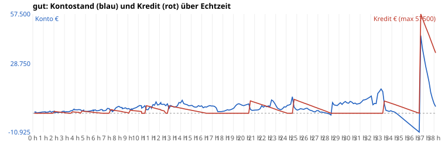
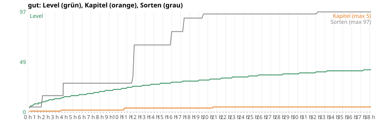
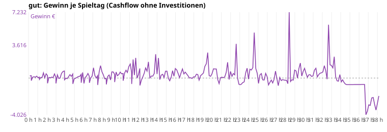


#### Je Echtzeit-Stunde

| Stunde | Spieltag (Datum) | Konto | Kredit | Gewinn/Tag Ø | Level | Kap. | Sorten | Regale | gekauft in dieser Stunde |
|---|---|---|---|---|---|---|---|---|---|
| 1 | 7 (Fr 8.10.) | 766 € | – | 156 € | 8 | 1 | 5 | 5 | Regal ×5 |
| 2 | 15 (Sa 16.10.) | 1.148 € | 1.100 € | 229 € | 11 | 1 | 16 | 8 | Regal ×4, Liz:jugend, shop_halb |
| 3 | 24 (Mo 25.10.) | 922 € | 200 € | 160 € | 13 | 1 | 16 | 9 | Regal |
| 4 | 31 (Mo 1.11.) | 2.059 € | 643 € | 327 € | 15 | 2 | 28 | 10 | Regal, lager, Liz:zubehoer |
| 5 | 39 (Di 9.11.) | 1.093 € | 963 € | 144 € | 16 | 2 | 28 | 10 | terminal, lager_nord |
| 6 | 46 (Di 16.11.) | 1.435 € | 350 € | 142 € | 17 | 2 | 28 | 10 | – |
| 7 | 54 (Mi 24.11.) | 2.815 € | – | 334 € | 18 | 2 | 28 | 10 | sackkarre |
| 8 | 62 (Do 2.12.) | 3.998 € | 1.294 € | 518 € | 20 | 2 | 28 | 10 | musik, plakat, testfeld |
| 9 | 69 (Do 9.12.) | 2.765 € | – | 141 € | 21 | 2 | 28 | 10 | grosskunden, heizung |
| 10 | 77 (Fr 17.12.) | 4.514 € | 1.140 € | 499 € | 22 | 2 | 28 | 10 | onlineshop |
| 11 | 84 (Fr 24.12.) | 3.615 € | 3.910 € | 884 € | 24 | 4 | 28 | 14 | regallicht, shop_gross, Regal ×4 |
| 12 | 92 (Sa 1.1.) | 6.195 € | 2.070 € | 948 € | 25 | 4 | 65 | 17 | Regal ×3, Liz:snacks, Liz:klassiker, Liz:partydeko |
| 13 | 99 (Sa 8.1.) | 4.525 € | 4.125 € | 670 € | 26 | 4 | 65 | 17 | tag4, cams, lager_gross |
| 14 | 106 (Sa 15.1.) | 7.553 € | 2.813 € | 890 € | 27 | 4 | 65 | 17 | Regal ×5 |
| 15 | 112 (Fr 21.1.) | 4.540 € | 1.688 € | 356 € | 28 | 4 | 65 | 18 | Regal ×7 |
| 16 | 119 (Fr 28.1.) | 3.217 € | 375 € | 387 € | 29 | 4 | 78 | 19 | Regal ×4, Liz:buffet |
| 17 | 125 (Do 3.2.) | 4.208 € | – | 531 € | 29 | 4 | 78 | 19 | Regal ×3 |
| 18 | 132 (Do 10.2.) | 1.221 € | – | 138 € | 30 | 4 | 91 | 20 | Regal ×3, Liz:krach |
| 19 | 138 (Mi 16.2.) | 3.023 € | – | 300 € | 31 | 4 | 91 | 20 | – |
| 20 | 145 (Mi 23.2.) | 4.776 € | – | 1.082 € | 31 | 4 | 95 | 20 | Regal ×6, Liz:kleinfeuer |
| 21 | 151 (Di 1.3.) | 1.831 € | 6.250 € | 228 € | 32 | 5 | 95 | 20 | Regal ×3, labor |
| 22 | 157 (Mo 7.3.) | 4.254 € | 4.375 € | 516 € | 33 | 5 | 95 | 20 | Regal |
| 23 | 164 (Mo 14.3.) | 4.312 € | 2.188 € | 487 € | 34 | 5 | 95 | 20 | Regal ×5 |
| 24 | 171 (Mo 21.3.) | 4.574 € | – | 133 € | 34 | 5 | 95 | 20 | Regal |
| 25 | 177 (So 27.3.) | 1.806 € | 7.350 € | 1.335 € | 35 | 5 | 95 | 20 | Regal ×6, gravur, radio, wagen, lager_sued |
| 26 | 184 (So 3.4.) | 2.175 € | 4.900 € | 53 € | 36 | 5 | 95 | 20 | – |
| 27 | 190 (Sa 9.4.) | 1.498 € | 2.800 € | -113 € | 36 | 5 | 95 | 20 | – |
| 28 | 197 (Sa 16.4.) | -413 € | 350 € | -273 € | 36 | 5 | 95 | 20 | – |
| 29 | 204 (Sa 23.4.) | 6.098 € | – | 1.069 € | 37 | 5 | 95 | 20 | Regal |
| 30 | 210 (Fr 29.4.) | 6.880 € | – | 777 € | 37 | 5 | 95 | 20 | Regal ×4 |
| 31 | 217 (Fr 6.5.) | 6.593 € | – | 375 € | 38 | 5 | 95 | 20 | Regal ×3 |
| 32 | 223 (Do 12.5.) | 9.969 € | – | 563 € | 39 | 5 | 95 | 20 | – |
| 33 | 230 (Do 19.5.) | 12.570 € | – | 1.693 € | 39 | 5 | 97 | 20 | alarm, Liz:feuerzauber, Team:reinigung, kundenkarte |
| 34 | 236 (Mi 25.5.) | 1.040 € | 5.550 € | 307 € | 40 | 5 | 97 | 26 | Regal ×7, shop_ost |
| 35 | 243 (Mi 1.6.) | -3.117 € | 3.392 € | -594 € | 40 | 5 | 97 | 26 | – |
| 36 | 250 (Mi 8.6.) | -8.100 € | 1.233 € | -712 € | 40 | 5 | 97 | 26 | – |
| 37 | 257 (Mi 15.6.) | 32.527 € | 52.500 € | -1.919 € | 40 | 5 | 97 | 31 | Regal ×6 |
| 38 | 264 (Mi 22.6.) | 3.833 € | 35.000 € | -2.639 € | 41 | 5 | 97 | 35 | Regal ×4 |

#### Meilensteine (Echtzeit h:mm)

| Zeit | Tag | Ereignis |
|---|---|---|
| 1:29 | 12 | Liz:jugend |
| 1:55 | 15 | shop_halb |
| 3:36 | 28 | lager |
| 3:45 | 28 | KAPITEL 2 |
| 3:54 | 30 | Liz:zubehoer |
| 4:31 | 35 | terminal |
| 4:31 | 35 | lager_nord |
| 6:28 | 50 | sackkarre |
| 7:05 | 55 | musik |
| 7:14 | 56 | plakat |
| 7:14 | 56 | testfeld |
| 8:09 | 63 | grosskunden |
| 8:47 | 68 | heizung |
| 9:05 | 70 | onlineshop |
| 10:08 | 78 | regallicht |
| 10:37 | 82 | shop_gross |
| 10:46 | 82 | KAPITEL 4 |
| 11:32 | 89 | Liz:snacks |
| 11:40 | 90 | Liz:klassiker |
| 11:40 | 90 | Liz:partydeko |
| 12:45 | 98 | tag4 |
| 12:45 | 98 | cams |
| 12:45 | 98 | lager_gross |
| 15:50 | 118 | Liz:buffet |
| 17:13 | 127 | Liz:krach |
| 19:21 | 141 | Liz:kleinfeuer |
| 20:27 | 148 | labor |
| 20:37 | 148 | KAPITEL 5 |
| 24:35 | 175 | gravur |
| 24:35 | 175 | radio |
| 24:35 | 175 | wagen |
| 24:35 | 175 | lager_sued |
| 32:04 | 224 | alarm |
| 32:04 | 224 | Liz:feuerzauber |
| 32:59 | 230 | kundenkarte |
| 33:09 | 231 | shop_ost |

#### Durststrecken (> 20 Min Echtzeit ohne spürbaren Fortschritt)

Spürbar = Ausbau, Lizenz, neue Mitarbeiter, Kapitel. Level-Aufstiege und Regale zählen nicht (Level schaltet nur frei, was man sich dann noch leisten muss).

| von | bis | Dauer | Spieltage | Level dabei | Konto am Ende |
|---|---|---|---|---|---|
| 0:00 | 1:29 | 89 min | 0–11 | 4→9 | 734 € |
| 1:29 | 1:55 | 26 min | 12–14 | 10→10 | 1.059 € |
| 1:55 | 3:36 | 101 min | 15–27 | 11→13 | 1.401 € |
| 3:54 | 4:31 | 36 min | 30–34 | 14→15 | 2.019 € |
| 4:31 | 6:28 | 117 min | 35–49 | 15→17 | 2.203 € |
| 6:28 | 7:05 | 36 min | 50–54 | 18→18 | 2.815 € |
| 7:14 | 8:09 | 55 min | 56–62 | 19→20 | 3.998 € |
| 8:09 | 8:47 | 38 min | 63–67 | 20→21 | 3.177 € |
| 9:05 | 10:08 | 63 min | 69–77 | 21→22 | 4.514 € |
| 10:08 | 10:37 | 29 min | 78–81 | 22→23 | 4.383 € |
| 10:46 | 11:32 | 46 min | 83–88 | 23→24 | 4.643 € |
| 11:40 | 12:45 | 64 min | 90–97 | 25→26 | 5.486 € |
| 12:45 | 15:50 | 185 min | 98–117 | 26→28 | 3.967 € |
| 15:50 | 17:13 | 83 min | 118–126 | 29→30 | 3.992 € |
| 17:13 | 19:21 | 128 min | 127–140 | 30→31 | 5.206 € |
| 19:21 | 20:27 | 66 min | 141–147 | 31→32 | 5.429 € |
| 20:37 | 24:35 | 238 min | 149–174 | 32→35 | 9.583 € |
| 24:35 | 32:04 | 449 min | 175–223 | 35→39 | 9.969 € |
| 32:04 | 32:59 | 56 min | 224–229 | 39→39 | 14.058 € |
| 33:09 | 38:09 | 300 min | 231–264 | 40→41 | 3.833 € |

#### Geld stapelt sich (zu leicht?)

Tage, an denen das Konto mehr als das Dreifache der teuersten jetzt kaufbaren, noch offenen Sache (Ausbau/Lizenz) zeigt – oder nichts mehr zu kaufen ist.

Kein Tag.

#### Wie weit ist die nächste Fläche? (Stichproben je Stunde)

Nächste kaufbare Fläche (Level und Voraussetzung erfüllt) und die nächste, die noch am Level hängt. „Tage“ = bis das Konto den Preis zeigt, bei Ø-Gewinn der letzten 7 Tage.

| Stunde | Level | nächste kaufbare Fläche | Kosten | Konto | Tage bis bezahlbar | nächste Fläche per Level gesperrt | Level fehlen |
|---|---|---|---|---|---|---|---|
| 1 | 8 | lager | 1.200 € | 766 € | 4 | shop_gross (L11) | 3 |
| 2 | 11 | lager | 1.200 € | 1.148 € | 1 | lager_gross (L13) | 2 |
| 3 | 13 | lager | 1.200 € | 922 € | 2 | onlineshop (L15) | 2 |
| 4 | 15 | lager_nord | 1.900 € | 2.059 € | 0 | lager_sued (L18) | 3 |
| 5 | 16 | onlineshop | 3.200 € | 1.093 € | 12 | lager_sued (L18) | 2 |
| 6 | 17 | onlineshop | 3.200 € | 1.435 € | 13 | lager_sued (L18) | 1 |
| 7 | 18 | onlineshop | 3.200 € | 2.815 € | 2 | labor (L20) | 2 |
| 8 | 20 | onlineshop | 3.200 € | 3.998 € | 0 | shop_ost (L21) | 1 |
| 9 | 21 | onlineshop | 3.200 € | 2.765 € | 4 | shop_sued (L24) | 3 |
| 10 | 22 | lager_gross | 6.200 € | 4.514 € | 4 | shop_sued (L24) | 2 |
| 11 | 24 | lager_gross | 6.200 € | 3.615 € | 3 | lager_sued2 (L25) | 1 |
| 12 | 25 | lager_gross | 6.200 € | 6.195 € | 1 | packstation2 (L27) | 2 |
| 13 | 26 | labor | 9.800 € | 4.525 € | 8 | packstation2 (L27) | 1 |
| 14 | 27 | labor | 9.800 € | 7.553 € | 3 | lager_west (L28) | 1 |
| 15 | 28 | labor | 9.800 € | 4.540 € | 9 | lager_west2 (L29) | 1 |
| 16 | 29 | labor | 9.800 € | 3.217 € | 18 | rampe4 (L30) | 1 |
| 17 | 29 | labor | 9.800 € | 4.208 € | 10 | rampe4 (L30) | 1 |
| 18 | 30 | labor | 9.800 € | 1.221 € | 63 | rampe5 (L31) | 1 |
| 19 | 31 | labor | 9.800 € | 3.023 € | 25 | – | – |
| 20 | 31 | labor | 9.800 € | 4.776 € | 5 | – | – |
| 21 | 32 | lager_sued | 11.000 € | 1.831 € | 27 | – | – |
| 22 | 33 | lager_sued | 11.000 € | 4.254 € | 15 | – | – |
| 23 | 34 | lager_sued | 11.000 € | 4.312 € | 14 | – | – |
| 24 | 34 | lager_sued | 11.000 € | 4.574 € | 49 | – | – |
| 25 | 35 | lager_sued2 | 15.000 € | 1.806 € | 11 | – | – |
| 26 | 36 | lager_sued2 | 15.000 € | 2.175 € | 244 | – | – |
| 27 | 36 | lager_sued2 | 15.000 € | 1.498 € | ∞ | – | – |
| 28 | 36 | lager_sued2 | 15.000 € | -413 € | ∞ | – | – |
| 29 | 37 | lager_sued2 | 15.000 € | 6.098 € | 9 | – | – |
| 30 | 37 | lager_sued2 | 15.000 € | 6.880 € | 11 | – | – |
| 31 | 38 | lager_sued2 | 15.000 € | 6.593 € | 23 | – | – |
| 32 | 39 | lager_sued2 | 15.000 € | 9.969 € | 9 | – | – |
| 33 | 39 | lager_sued2 | 15.000 € | 12.570 € | 2 | – | – |
| 34 | 40 | eingang2 | 11.500 € | 1.040 € | 25 | – | – |
| 35 | 40 | eingang2 | 11.500 € | -3.117 € | ∞ | – | – |
| 36 | 40 | eingang2 | 11.500 € | -8.100 € | ∞ | – | – |
| 37 | 40 | eingang2 | 11.500 € | 32.527 € | 0 | – | – |
| 38 | 41 | eingang2 | 11.500 € | 3.833 € | ∞ | – | – |

#### Amortisation der Käufe (aus dem Lauf geschätzt)

Gewinn/Tag = Kontoveränderung ohne Investitionen und Kredite, saisonbereinigt (÷ Tagesfaktor dayMult). Vorher = Ø 5 offene Tage davor, nachher = Ø 7 offene Tage danach. Grob: Saison, Ereignisse und weitere Käufe in der Zeit mischen mit.

| Tag | Kauf | Kosten | Gewinn/Tag vorher | nachher | Δ/Tag | Amortisation (Spieltage ≈ Echtzeit) |
|---|---|---|---|---|---|---|
| 12 | Liz:jugend | 60 € | 107 € | 139 € | 32 € | 2 Tage ≈ 0:16 h |
| 15 | shop_halb | 1.400 € | 260 € | 173 € | -87 € | nicht messbar |
| 28 | lager | 1.200 € | 177 € | 221 € | 44 € | 27 Tage ≈ 3:50 h |
| 30 | Liz:zubehoer | 120 € | 256 € | 138 € | -118 € | nicht messbar |
| 35 | terminal | 320 € | 199 € | 149 € | -50 € | nicht messbar |
| 35 | lager_nord | 1.900 € | 199 € | 149 € | -50 € | nicht messbar |
| 50 | sackkarre | 350 € | 165 € | 473 € | 308 € | 1 Tage ≈ 0:10 h |
| 55 | musik | 380 € | 487 € | 575 € | 88 € | 4 Tage ≈ 0:37 h |
| 56 | plakat | 400 € | 461 € | 569 € | 108 € | 4 Tage ≈ 0:31 h |
| 56 | testfeld | 3.200 € | 461 € | 569 € | 108 € | 30 Tage ≈ 4:11 h |
| 63 | grosskunden | 500 € | 816 € | 241 € | -575 € | nicht messbar |
| 68 | heizung | 450 € | 156 € | 481 € | 324 € | 1 Tage ≈ 0:12 h |
| 70 | onlineshop | 3.200 € | 188 € | 419 € | 232 € | 14 Tage ≈ 1:57 h |
| 78 | regallicht | 700 € | 465 € | 795 € | 331 € | 2 Tage ≈ 0:18 h |
| 82 | shop_gross | 7.500 € | 521 € | 691 € | 170 € | 44 Tage ≈ 6:15 h |
| 89 | Liz:snacks | 260 € | 772 € | 365 € | -407 € | nicht messbar |
| 90 | Liz:klassiker | 380 € | 767 € | 472 € | -295 € | nicht messbar |
| 90 | Liz:partydeko | 520 € | 767 € | 472 € | -295 € | nicht messbar |
| 98 | tag4 | 900 € | 493 € | 965 € | 472 € | 2 Tage ≈ 0:16 h |
| 98 | cams | 900 € | 493 € | 965 € | 472 € | 2 Tage ≈ 0:16 h |
| 98 | lager_gross | 6.200 € | 493 € | 965 € | 472 € | 13 Tage ≈ 1:52 h |
| 118 | Liz:buffet | 700 € | 203 € | 827 € | 624 € | 1 Tage ≈ 0:10 h |
| 127 | Liz:krach | 1.100 € | 940 € | 179 € | -761 € | nicht messbar |
| 141 | Liz:kleinfeuer | 1.800 € | 1.090 € | 801 € | -289 € | nicht messbar |
| 148 | labor | 9.800 € | 1.023 € | 161 € | -862 € | nicht messbar |
| 175 | gravur | 1.200 € | 2.074 € | 49 € | -2.025 € | nicht messbar |
| 175 | radio | 1.200 € | 2.074 € | 49 € | -2.025 € | nicht messbar |
| 175 | wagen | 1.400 € | 2.074 € | 49 € | -2.025 € | nicht messbar |
| 175 | lager_sued | 11.000 € | 2.074 € | 49 € | -2.025 € | nicht messbar |
| 224 | alarm | 2.200 € | 587 € | 2.175 € | 1.588 € | 1 Tage ≈ 0:12 h |
| 224 | Liz:feuerzauber | 4.200 € | 587 € | 2.175 € | 1.588 € | 3 Tage ≈ 0:22 h |
| 228 | Team:reinigung (Lohn läuft mit) | 250 € | 2.052 € | 652 € | -1.399 € | nicht messbar |
| 230 | kundenkarte | 2.600 € | 2.390 € | 127 € | -2.264 € | nicht messbar |
| 231 | shop_ost | 16.000 € | 2.504 € | -221 € | -2.725 € | nicht messbar |

#### Umsatzanteile (je 30 Spieltage)

| Tage | Feuerwerk (F1+F2) | Zubehör/Party/Essen | eigene Marke | Online-Pauschale | Versand (Pakete) | Umsatz gesamt |
|---|---|---|---|---|---|---|
| 0–29 | 100 % | 0 % | 0 % | 0 % | 0 % | 11.628 € |
| 30–59 | 70 % | 30 % | 0 % | 0 % | 0 % | 14.835 € |
| 60–89 | 53 % | 31 % | 0 % | 16 % | 0 % | 32.277 € |
| 90–119 | 28 % | 52 % | 0 % | 20 % | 0 % | 37.990 € |
| 120–149 | 32 % | 48 % | 0 % | 20 % | 0 % | 38.825 € |
| 150–179 | 40 % | 43 % | 0 % | 16 % | 0 % | 48.937 € |
| 180–209 | 32 % | 49 % | 0 % | 19 % | 0 % | 32.177 € |
| 210–239 | 37 % | 47 % | 0 % | 16 % | 0 % | 44.427 € |
| 240–264 | 29 % | 45 % | 0 % | 26 % | 0 % | 19.341 € |

<details><summary>Alle Spieltage</summary>

| Tag | Datum | Echtzeit | Umsatz | Kunden | verpasst | Ware | Gewinn | Konto | Kredit | Lvl | Kap | Ruf | Käufe |
|---|---|---|---|---|---|---|---|---|---|---|---|---|---|
| 0 | Fr 1.10. | 0:09 | 233 | 48 | 67 | 93 | 237 | 692 |  | 4 | 1 | 51 | Regal:klein |
| 1 | Sa 2.10. | 0:18 | 398 | 58 | 0 | 240 | 267 | 756 |  | 6 | 1 | 90 | Regal:klein Regal:standard |
| 2 | So 3.10. Ruhetag | 0:18 | 0 | 0 | 0 | 229 | -277 | 178 |  | 6 | 1 | 90 | Regal:klein Regal:standard |
| 3 | Mo 4.10. | 0:27 | 195 | 31 | 0 | 50 | 97 | 275 |  | 6 | 1 | 100 |  |
| 4 | Di 5.10. | 0:36 | 251 | 32 | 0 | 56 | 144 | 419 |  | 7 | 1 | 100 |  |
| 5 | Mi 6.10. | 0:45 | 211 | 28 | 0 | 67 | 92 | 511 |  | 8 | 1 | 100 |  |
| 6 | Do 7.10. | 0:53 | 176 | 21 | 0 | 78 | 212 | 723 |  | 8 | 1 | 99 |  |
| 7 | Fr 8.10. | 1:02 | 123 | 18 | 0 | 24 | 43 | 766 |  | 8 | 1 | 100 |  |
| 8 | Sa 9.10. | 1:11 | 203 | 37 | 0 | 38 | 109 | 875 |  | 8 | 1 | 100 |  |
| 9 | So 10.10. Ruhetag | 1:12 | 0 | 0 | 0 | 88 | -148 | 598 |  | 9 | 1 | 100 | Regal:klein |
| 10 | Mo 11.10. | 1:20 | 133 | 22 | 0 | 0 | 69 | 667 |  | 9 | 1 | 100 |  |
| 11 | Di 12.10. | 1:29 | 158 | 28 | 0 | 28 | 67 | 734 |  | 9 | 1 | 100 |  |
| 12 | Mi 13.10. | 1:38 | 422 | 30 | 0 | 228 | 571 | 1245 |  | 10 | 1 | 100 | Liz:jugend |
| 13 | Do 14.10. | 1:46 | 462 | 26 | 0 | 348 | 33 | 591 |  | 10 | 1 | 100 | Regal:klein Regal:standard Regal:hoch |
| 14 | Fr 15.10. | 1:55 | 614 | 37 | 0 | 185 | 468 | 1059 |  | 10 | 1 | 100 |  |
| 15 | Sa 16.10. | 2:04 | 795 | 42 | 1 | 306 | 289 | 1148 | 1100 | 11 | 1 | 100 | Kredit:1200 shop_halb |
| 16 | So 17.10. Ruhetag | 2:05 | 0 | 0 | 0 | 370 | -574 | 389 | 1000 | 11 | 1 | 100 | Regal:klein |
| 17 | Mo 18.10. | 2:14 | 408 | 25 | 0 | 133 | 74 | 463 | 900 | 11 | 1 | 100 |  |
| 18 | Di 19.10. | 2:22 | 412 | 38 | 0 | 186 | 25 | 488 | 800 | 12 | 1 | 100 |  |
| 19 | Mi 20.10. | 2:31 | 401 | 26 | 0 | 87 | 110 | 598 | 700 | 12 | 1 | 98 |  |
| 20 | Do 21.10. | 2:40 | 361 | 21 | 0 | 118 | 41 | 639 | 600 | 12 | 1 | 99 |  |
| 21 | Fr 22.10. | 2:50 | 683 | 33 | 0 | 26 | 456 | 1095 | 500 | 12 | 1 | 100 |  |
| 22 | Sa 23.10. | 2:59 | 657 | 40 | 0 | 387 | 67 | 1162 | 400 | 13 | 1 | 100 |  |
| 23 | So 24.10. Ruhetag | 2:59 | 0 | 0 | 0 | 384 | -587 | 575 | 300 | 13 | 1 | 100 |  |
| 24 | Mo 25.10. | 3:09 | 572 | 28 | 0 | 25 | 347 | 922 | 200 | 13 | 1 | 100 |  |
| 25 | Di 26.10. | 3:18 | 411 | 26 | 0 | 258 | -47 | 875 | 100 | 13 | 1 | 97 |  |
| 26 | Mi 27.10. | 3:26 | 356 | 21 | 0 | 143 | 15 | 890 |  | 13 | 1 | 100 |  |
| 27 | Do 28.10. | 3:36 | 720 | 42 | 0 | 112 | 511 | 1401 |  | 13 | 1 | 100 |  |
| 28 | Fr 29.10. | 3:45 | 1276 | 50 | 0 | 370 | 723 | 1611 | 836 | 14 | 2 | 95 | Regal:klein Kredit:900 lager |
| 29 | Sa 30.10. | 3:54 | 995 | 56 | 0 | 30 | 778 | 2389 | 771 | 14 | 2 | 100 |  |
| 30 | So 31.10. Ruhetag | 3:55 | 0 | 0 | 0 | 0 | -192 | 2077 | 707 | 14 | 2 | 100 | Liz:zubehoer |
| 31 | Mo 1.11. | 4:04 | 394 | 17 | 0 | 271 | -18 | 2059 | 643 | 15 | 2 | 97 |  |
| 32 | Di 2.11. | 4:13 | 448 | 22 | 3 | 304 | -62 | 1997 | 579 | 15 | 2 | 97 |  |
| 33 | Mi 3.11. | 4:22 | 539 | 28 | 5 | 229 | 159 | 2156 | 514 | 15 | 2 | 100 |  |
| 34 | Do 4.11. | 4:31 | 602 | 28 | 14 | 79 | 377 | 2019 |  | 15 | 2 | 99 | Tilgung |
| 35 | Fr 5.11. | 4:40 | 659 | 38 | 15 | 210 | 189 | 1388 | 1313 | 15 | 2 | 100 | terminal Kredit:1400 lager_nord |
| 36 | Sa 6.11. | 4:49 | 1033 | 67 | 17 | 322 | 442 | 1830 | 1225 | 16 | 2 | 100 |  |
| 37 | So 7.11. Ruhetag | 4:50 | 0 | 0 | 0 | 366 | -638 | 1192 | 1138 | 16 | 2 | 100 |  |
| 38 | Mo 8.11. | 4:59 | 319 | 23 | 7 | 129 | -87 | 1105 | 1050 | 16 | 2 | 100 |  |
| 39 | Di 9.11. | 5:07 | 331 | 22 | 4 | 60 | -12 | 1093 | 963 | 16 | 2 | 97 |  |
| 40 | Mi 10.11. | 5:16 | 402 | 23 | 5 | 52 | 62 | 1155 | 875 | 16 | 2 | 100 |  |
| 41 | Do 11.11. | 5:26 | 459 | 24 | 2 | 0 | 174 | 1329 | 788 | 16 | 2 | 99 |  |
| 42 | Fr 12.11. | 5:35 | 467 | 33 | 1 | 0 | 183 | 1512 | 700 | 16 | 2 | 92 |  |
| 43 | Sa 13.11. | 5:44 | 693 | 45 | 11 | 0 | 406 | 1918 | 613 | 17 | 2 | 100 |  |
| 44 | So 14.11. Ruhetag | 5:44 | 0 | 0 | 0 | 226 | -512 | 1406 | 525 | 17 | 2 | 100 |  |
| 45 | Mo 15.11. | 5:54 | 903 | 39 | 10 | 0 | 619 | 2025 | 438 | 17 | 2 | 99 |  |
| 46 | Di 16.11. | 6:02 | 186 | 12 | 5 | 494 | -590 | 1435 | 350 | 17 | 2 | 97 |  |
| 47 | Mi 17.11. | 6:10 | 438 | 20 | 12 | 107 | 50 | 1485 | 263 | 17 | 2 | 98 |  |
| 48 | Do 18.11. | 6:19 | 583 | 24 | 4 | 89 | 214 | 1699 | 175 | 17 | 2 | 96 |  |
| 49 | Fr 19.11. | 6:28 | 955 | 41 | 13 | 173 | 504 | 2203 | 88 | 17 | 2 | 100 |  |
| 50 | Sa 20.11. | 6:37 | 740 | 42 | 5 | 351 | 196 | 1961 |  | 18 | 2 | 100 | sackkarre Tilgung |
| 51 | So 21.11. Ruhetag | 6:38 | 0 | 0 | 0 | 328 | -521 | 1440 |  | 18 | 2 | 100 |  |
| 52 | Mo 22.11. | 6:47 | 431 | 24 | 3 | 206 | 31 | 1471 |  | 18 | 2 | 98 |  |
| 53 | Di 23.11. | 6:56 | 406 | 27 | 1 | 0 | 213 | 1684 |  | 18 | 2 | 99 |  |
| 54 | Mi 24.11. | 7:05 | 499 | 29 | 3 | 0 | 1131 | 2815 |  | 18 | 2 | 97 |  |
| 55 | Do 25.11. | 7:14 | 485 | 29 | 3 | 12 | 280 | 2715 |  | 18 | 2 | 100 | musik |
| 56 | Fr 26.11. | 7:22 | 649 | 52 | 13 | 268 | 6 | 1421 | 2156 | 19 | 2 | 96 | plakat Kredit:2300 testfeld |
| 57 | Sa 27.11. | 7:32 | 980 | 56 | 11 | 343 | 265 | 1686 | 2013 | 19 | 2 | 100 |  |
| 58 | So 28.11. Ruhetag | 7:32 | 0 | 0 | 0 | 390 | -761 | 925 | 1869 | 19 | 2 | 100 |  |
| 59 | Mo 29.11. | 7:42 | 1230 | 60 | 8 | 193 | 668 | 1593 | 1725 | 19 | 2 | 100 |  |
| 60 | Di 30.11. | 7:50 | 1212 | 51 | 7 | 350 | 1361 | 2954 | 1581 | 19 | 2 | 100 |  |
| 61 | Mi 1.12. | 8:00 | 1459 | 63 | 16 | 389 | 701 | 3655 | 1438 | 20 | 2 | 100 |  |
| 62 | Do 2.12. | 8:09 | 1192 | 58 | 11 | 484 | 343 | 3998 | 1294 | 20 | 2 | 100 |  |
| 63 | Fr 3.12. | 8:18 | 668 | 37 | 3 | 391 | -88 | 3410 | 1150 | 20 | 2 | 96 | grosskunden |
| 64 | Sa 4.12. | 8:28 | 698 | 40 | 8 | 389 | -53 | 3357 | 1006 | 20 | 2 | 94 |  |
| 65 | So 5.12. Ruhetag | 8:28 | 0 | 0 | 0 | 338 | -698 | 2659 | 863 | 20 | 2 | 94 |  |
| 66 | Mo 6.12. | 8:37 | 930 | 40 | 5 | 394 | 179 | 2838 | 719 | 21 | 2 | 96 |  |
| 67 | Di 7.12. | 8:47 | 775 | 42 | 3 | 76 | 339 | 3177 | 575 | 21 | 2 | 96 |  |
| 68 | Mi 8.12. | 8:56 | 504 | 36 | 10 | 359 | -211 | 2516 | 431 | 21 | 2 | 88 | heizung |
| 69 | Do 9.12. | 9:05 | 999 | 55 | 2 | 113 | 681 | 2765 |  | 21 | 2 | 96 | Tilgung |
| 70 | Fr 10.12. | 9:14 | 1113 | 74 | 14 | 392 | 669 | 2134 | 1805 | 21 | 2 | 96 | Kredit:1900 onlineshop |
| 71 | Sa 11.12. | 9:22 | 827 | 51 | 16 | 366 | 407 | 2541 | 1710 | 21 | 2 | 94 |  |
| 72 | So 12.12. Ruhetag | 9:23 | 0 | 0 | 0 | 391 | -443 | 2098 | 1615 | 21 | 2 | 94 |  |
| 73 | Mo 13.12. | 9:32 | 877 | 50 | 13 | 170 | 659 | 2757 | 1520 | 22 | 2 | 96 |  |
| 74 | Di 14.12. | 9:41 | 643 | 40 | 7 | 333 | 259 | 3016 | 1425 | 22 | 2 | 94 |  |
| 75 | Mi 15.12. | 9:50 | 746 | 46 | 5 | 311 | 387 | 3403 | 1330 | 22 | 2 | 94 |  |
| 76 | Do 16.12. | 9:59 | 850 | 51 | 13 | 152 | 653 | 4056 | 1235 | 22 | 2 | 95 |  |
| 77 | Fr 17.12. | 10:08 | 902 | 50 | 19 | 360 | 458 | 4514 | 1140 | 22 | 2 | 71 |  |
| 78 | Sa 18.12. | 10:18 | 1015 | 55 | 19 | 431 | 505 | 4319 | 1045 | 22 | 2 | 72 | regallicht |
| 79 | So 19.12. Ruhetag | 10:18 | 0 | 0 | 0 | 323 | -289 | 2985 |  | 22 | 2 | 72 | Tilgung |
| 80 | Mo 20.12. | 10:28 | 868 | 49 | 10 | 390 | 536 | 3521 |  | 23 | 2 | 87 |  |
| 81 | Di 21.12. | 10:37 | 1182 | 48 | 13 | 392 | 862 | 4383 |  | 23 | 2 | 96 |  |
| 82 | Mi 22.12. | 10:46 | 1262 | 67 | 22 | 422 | 609 | 2092 | 4370 | 23 | 4 | 96 | Kredit:4600 shop_gross |
| 83 | Do 23.12. | 10:55 | 1802 | 90 | 35 | 282 | 1251 | 2072 | 4140 | 23 | 4 | 96 | Regal:klein Regal:standard Regal:hoch Regal:kuehl |
| 84 | Fr 24.12. | 11:05 | 1812 | 96 | 78 | 0 | 1543 | 3615 | 3910 | 24 | 4 | 95 |  |
| 85 | Sa 25.12. | 11:13 | 1179 | 91 | 203 | 226 | 621 | 3676 | 3680 | 24 | 4 | 61 | Regal:gondel |
| 86 | So 26.12. Ruhetag | 11:14 | 0 | 0 | 0 | 319 | -648 | 3028 | 3450 | 24 | 4 | 61 |  |
| 87 | Mo 27.12. | 11:23 | 1680 | 83 | 107 | 479 | 2038 | 5066 | 3220 | 24 | 4 | 66 |  |
| 88 | Di 28.12. | 11:32 | 1041 | 74 | 219 | 332 | 327 | 4643 | 2990 | 24 | 4 | 33 | Regal:gondel |
| 89 | Mi 29.12. | 11:40 | 918 | 87 | 341 | 333 | 2215 | 6598 | 2760 | 25 | 4 | 0 | Liz:snacks |
| 90 | Do 30.12. | 11:49 | 817 | 69 | 258 | 384 | -6 | 4752 | 2530 | 25 | 4 | 0 | Regal:gondel Liz:klassiker Liz:partydeko |
| 91 | Fr 31.12. | 11:58 | 1174 | 73 | 393 | 420 | 387 | 5139 | 2300 | 25 | 4 | 0 |  |
| 92 | Sa 1.1. | 12:07 | 572 | 47 | 155 | 384 | 1056 | 6195 | 2070 | 25 | 4 | 0 |  |
| 93 | So 2.1. Ruhetag | 12:08 | 0 | 0 | 0 | 382 | -811 | 5384 | 1840 | 25 | 4 | 0 |  |
| 94 | Mo 3.1. | 12:17 | 587 | 32 | 14 | 434 | -261 | 5123 | 1610 | 25 | 4 | 7 |  |
| 95 | Di 4.1. | 12:26 | 502 | 29 | 4 | 0 | 108 | 5231 | 1380 | 25 | 4 | 17 |  |
| 96 | Mi 5.1. | 12:36 | 1233 | 56 | 28 | 572 | 525 | 4376 |  | 25 | 4 | 20 | Tilgung |
| 97 | Do 6.1. | 12:45 | 1587 | 68 | 22 | 377 | 1110 | 5486 |  | 26 | 4 | 42 |  |
| 98 | Fr 7.1. | 12:54 | 1554 | 72 | 45 | 449 | 764 | 2750 | 4313 | 26 | 4 | 59 | tag4 cams Kredit:4500 lager_gross |
| 99 | Sa 8.1. | 13:03 | 1365 | 81 | 58 | 420 | 1775 | 4525 | 4125 | 26 | 4 | 68 |  |
| 100 | So 9.1. | 13:13 | 660 | 48 | 25 | 314 | 17 | 4022 | 3938 | 26 | 4 | 74 | Regal:rhoch |
| 101 | Mo 10.1. | 13:23 | 906 | 57 | 48 | 369 | 226 | 3578 | 3750 | 26 | 4 | 86 | Regal:rhoch |
| 102 | Di 11.1. | 13:32 | 873 | 51 | 25 | 364 | 215 | 3793 | 3563 | 26 | 4 | 96 |  |
| 103 | Mi 12.1. | 13:41 | 1309 | 71 | 51 | 507 | 506 | 4299 | 3375 | 27 | 4 | 93 |  |
| 104 | Do 13.1. | 13:51 | 1252 | 75 | 96 | 534 | 2618 | 6247 | 3188 | 27 | 4 | 88 | Regal:rhoch |
| 105 | Fr 14.1. | 14:00 | 1065 | 72 | 94 | 395 | 443 | 6020 | 3000 | 27 | 4 | 81 | Regal:rhoch |
| 106 | Sa 15.1. | 14:09 | 1721 | 107 | 125 | 377 | 2203 | 7553 | 2813 | 27 | 4 | 96 | Regal:rhoch |
| 107 | So 16.1. | 14:18 | 517 | 35 | 67 | 377 | -162 | 5591 | 2625 | 27 | 4 | 90 | Regal:gondel Regal:rhoch |
| 108 | Mo 17.1. | 14:27 | 1022 | 54 | 69 | 410 | 319 | 5240 | 2438 | 27 | 4 | 93 | Regal:rhoch |
| 109 | Di 18.1. | 14:37 | 995 | 63 | 74 | 293 | 416 | 4986 | 2250 | 27 | 4 | 95 | Regal:rhoch |
| 110 | Mi 19.1. | 14:46 | 740 | 60 | 46 | 395 | 60 | 4376 | 2063 | 28 | 4 | 94 | Regal:rhoch |
| 111 | Do 20.1. | 14:55 | 1422 | 84 | 86 | 394 | 749 | 4455 | 1875 | 28 | 4 | 96 | Regal:rhoch |
| 112 | Fr 21.1. | 15:05 | 1442 | 77 | 100 | 398 | 755 | 4540 | 1688 | 28 | 4 | 87 | Regal:rhoch |
| 113 | Sa 22.1. | 15:14 | 687 | 61 | 125 | 363 | -17 | 3853 | 1500 | 28 | 4 | 52 | Regal:rhoch |
| 114 | So 23.1. | 15:23 | 483 | 29 | 25 | 438 | -299 | 3554 | 1313 | 28 | 4 | 49 |  |
| 115 | Mo 24.1. | 15:32 | 728 | 46 | 18 | 348 | 66 | 3620 | 1125 | 28 | 4 | 66 |  |
| 116 | Di 25.1. | 15:41 | 1500 | 85 | 48 | 423 | 814 | 4434 | 938 | 28 | 4 | 96 |  |
| 117 | Mi 26.1. | 15:50 | 865 | 50 | 37 | 403 | 203 | 3967 | 750 | 28 | 4 | 96 | Regal:rhoch |
| 118 | Do 27.1. | 15:59 | 1388 | 72 | 50 | 89 | 1044 | 4311 | 563 | 29 | 4 | 96 | Liz:buffet |
| 119 | Fr 28.1. | 16:08 | 1528 | 82 | 113 | 357 | 896 | 3217 | 375 | 29 | 4 | 91 | Regal:gondel Regal:rhoch |
| 120 | Sa 29.1. | 16:18 | 1219 | 83 | 147 | 450 | 487 | 3704 | 188 | 29 | 4 | 85 |  |
| 121 | So 30.1. | 16:27 | 633 | 39 | 34 | 513 | 42 | 3559 |  | 29 | 4 | 92 | Tilgung |
| 122 | Mo 31.1. | 16:37 | 1084 | 63 | 66 | 464 | 551 | 4110 |  | 29 | 4 | 96 |  |
| 123 | Di 1.2. | 16:46 | 1519 | 95 | 123 | 446 | 1001 | 4441 |  | 29 | 4 | 95 | Regal:rhoch |
| 124 | Mi 2.2. | 16:55 | 971 | 51 | 118 | 420 | 455 | 4226 |  | 29 | 4 | 80 | Regal:rhoch |
| 125 | Do 3.2. | 17:04 | 1142 | 65 | 102 | 390 | 652 | 4208 |  | 29 | 4 | 77 | Regal:rhoch |
| 126 | Fr 4.2. | 17:13 | 1076 | 69 | 131 | 493 | 454 | 3992 |  | 30 | 4 | 60 | Regal:rhoch |
| 127 | Sa 5.2. | 17:22 | 918 | 51 | 107 | 491 | 248 | 3140 |  | 30 | 4 | 28 | Liz:krach |
| 128 | So 6.2. | 17:31 | 372 | 23 | 39 | 153 | 8 | 968 |  | 30 | 4 | 17 | Regal:gondel Regal:rhoch |
| 129 | Mo 7.2. | 17:40 | 420 | 28 | 48 | 162 | 37 | 1005 |  | 30 | 4 | 10 |  |
| 130 | Di 8.2. | 17:49 | 389 | 24 | 27 | 197 | -40 | 965 |  | 30 | 4 | 4 |  |
| 131 | Mi 9.2. | 17:58 | 507 | 28 | 46 | 134 | 135 | 1100 |  | 30 | 4 | 0 |  |
| 132 | Do 10.2. | 18:07 | 643 | 35 | 36 | 294 | 121 | 1221 |  | 30 | 4 | 7 |  |
| 133 | Fr 11.2. | 18:17 | 1041 | 48 | 33 | 412 | 424 | 1645 |  | 30 | 4 | 20 |  |
| 134 | Sa 12.2. | 18:26 | 978 | 54 | 62 | 388 | 387 | 2032 |  | 30 | 4 | 22 |  |
| 135 | So 13.2. | 18:35 | 349 | 22 | 13 | 367 | -224 | 1808 |  | 30 | 4 | 21 |  |
| 136 | Mo 14.2. | 18:44 | 918 | 37 | 15 | 473 | 261 | 2069 |  | 30 | 4 | 34 |  |
| 137 | Di 15.2. | 18:53 | 1014 | 46 | 27 | 456 | 398 | 2467 |  | 30 | 4 | 49 |  |
| 138 | Mi 16.2. | 19:03 | 1422 | 54 | 21 | 727 | 556 | 3023 |  | 31 | 4 | 62 |  |
| 139 | Do 17.2. | 19:12 | 1927 | 63 | 35 | 535 | 1287 | 4310 |  | 31 | 4 | 82 |  |
| 140 | Fr 18.2. | 19:21 | 1941 | 93 | 86 | 292 | 1566 | 5206 |  | 31 | 4 | 96 | Regal:rhoch |
| 141 | Sa 19.2. | 19:31 | 1945 | 100 | 132 | 437 | 2794 | 5530 |  | 31 | 4 | 96 | Regal:rhoch Liz:kleinfeuer |
| 142 | So 20.2. | 19:40 | 703 | 40 | 59 | 344 | 263 | 5123 |  | 31 | 4 | 89 | Regal:rhoch |
| 143 | Mo 21.2. | 19:49 | 774 | 48 | 106 | 447 | 191 | 4644 |  | 31 | 4 | 63 | Regal:rhoch |
| 144 | Di 22.2. | 19:59 | 999 | 54 | 52 | 425 | 452 | 4426 |  | 31 | 4 | 72 | Regal:rhoch |
| 145 | Mi 23.2. | 20:09 | 1535 | 68 | 46 | 415 | 1020 | 4776 |  | 31 | 4 | 87 | Regal:rhoch |
| 146 | Do 24.2. | 20:18 | 1631 | 78 | 97 | 548 | 995 | 5101 |  | 32 | 4 | 94 | Regal:rhoch |
| 147 | Fr 25.2. | 20:27 | 1541 | 88 | 121 | 434 | 998 | 5429 |  | 32 | 4 | 80 | Regal:rhoch |
| 148 | Sa 26.2. | 20:37 | 1209 | 76 | 132 | 778 | -159 | 2300 | 7188 | 32 | 5 | 55 | Regal:rhoch Kredit:7500 labor |
| 149 | So 27.2. | 20:45 | 408 | 33 | 40 | 424 | -611 | 1689 | 6875 | 32 | 5 | 49 |  |
| 150 | Mo 28.2. | 20:54 | 1062 | 49 | 28 | 448 | 44 | 1733 | 6563 | 32 | 5 | 60 |  |
| 151 | Di 1.3. | 21:04 | 1049 | 56 | 48 | 386 | 98 | 1831 | 6250 | 32 | 5 | 61 |  |
| 152 | Mi 2.3. | 21:13 | 1077 | 56 | 52 | 478 | 41 | 1872 | 5938 | 32 | 5 | 62 |  |
| 153 | Do 3.3. | 21:22 | 1232 | 60 | 53 | 538 | 129 | 2001 | 5625 | 32 | 5 | 53 |  |
| 154 | Fr 4.3. | 21:32 | 1617 | 76 | 59 | 441 | 624 | 2624 | 5313 | 33 | 5 | 58 |  |
| 155 | Sa 5.3. | 21:41 | 2151 | 106 | 70 | 523 | 1732 | 4356 | 5000 | 33 | 5 | 91 |  |
| 156 | So 6.3. | 21:50 | 896 | 49 | 43 | 572 | -158 | 3528 | 4688 | 33 | 5 | 96 | Regal:rhoch |
| 157 | Mo 7.3. | 22:00 | 1764 | 101 | 150 | 546 | 726 | 4254 | 4375 | 33 | 5 | 86 |  |
| 158 | Di 8.3. | 22:09 | 1134 | 63 | 75 | 447 | 194 | 3778 | 4063 | 33 | 5 | 82 | Regal:rhoch |
| 159 | Mi 9.3. | 22:18 | 1429 | 77 | 104 | 449 | 502 | 4280 | 3750 | 33 | 5 | 89 |  |
| 160 | Do 10.3. | 22:27 | 1357 | 75 | 131 | 508 | 353 | 3963 | 3438 | 33 | 5 | 74 | Regal:rhoch |
| 161 | Fr 11.3. | 22:37 | 1376 | 77 | 176 | 380 | 3757 | 7720 | 3125 | 33 | 5 | 46 |  |
| 162 | Sa 12.3. | 22:46 | 1015 | 73 | 165 | 434 | 9 | 7059 | 2813 | 34 | 5 | 20 | Regal:rhoch |
| 163 | So 13.3. | 22:55 | 380 | 19 | 22 | 464 | -680 | 5709 | 2500 | 34 | 5 | 7 | Regal:rhoch |
| 164 | Mo 14.3. | 23:03 | 295 | 18 | 22 | 429 | -727 | 4312 | 2188 | 34 | 5 | 0 | Regal:rhoch |
| 165 | Di 15.3. | 23:10 | 360 | 20 | 8 | 454 | -677 | 2965 | 1875 | 34 | 5 | 2 | Regal:rhoch |
| 166 | Mi 16.3. | 23:19 | 621 | 26 | 24 | 539 | -500 | 2465 | 1563 | 34 | 5 | 1 |  |
| 167 | Do 17.3. | 23:29 | 993 | 33 | 12 | 850 | -421 | 2044 | 1250 | 34 | 5 | 8 |  |
| 168 | Fr 18.3. | 23:39 | 2072 | 57 | 13 | 968 | 584 | 2628 | 938 | 34 | 5 | 32 |  |
| 169 | Sa 19.3. | 23:49 | 2142 | 60 | 24 | 539 | 1082 | 3710 | 625 | 34 | 5 | 29 |  |
| 170 | So 20.3. | 23:58 | 852 | 31 | 14 | 468 | -112 | 3598 | 313 | 34 | 5 | 41 |  |
| 171 | Mo 21.3. | 24:07 | 2027 | 78 | 31 | 594 | 976 | 4574 |  | 34 | 5 | 62 |  |
| 172 | Di 22.3. | 24:16 | 1588 | 45 | 13 | 579 | 886 | 4790 |  | 34 | 5 | 71 | Regal:rhoch |
| 173 | Mi 23.3. | 24:26 | 1988 | 62 | 45 | 740 | 1139 | 5259 |  | 34 | 5 | 81 | Regal:rhoch |
| 174 | Do 24.3. | 24:35 | 2839 | 97 | 62 | 461 | 4994 | 9583 |  | 35 | 5 | 96 | Regal:rhoch |
| 175 | Fr 25.3. | 24:45 | 2114 | 99 | 127 | 462 | 1051 | 3564 | 8050 | 35 | 5 | 88 | Regal:rhoch gravur radio wagen Kredit:8400 lager_sued |
| 176 | Sa 26.3. | 24:54 | 1946 | 102 | 153 | 800 | 527 | 2391 | 7700 | 35 | 5 | 81 | Regal:rhoch Regal:rschwer |
| 177 | So 27.3. | 25:03 | 521 | 27 | 60 | 476 | -585 | 1806 | 7350 | 35 | 5 | 71 |  |
| 178 | Mo 28.3. | 25:12 | 1500 | 75 | 110 | 514 | 361 | 2167 | 7000 | 35 | 5 | 70 |  |
| 179 | Di 29.3. | 25:21 | 1618 | 92 | 147 | 490 | 496 | 2663 | 6650 | 35 | 5 | 62 |  |
| 180 | Mi 30.3. | 25:30 | 1028 | 65 | 114 | 577 | -205 | 2458 | 6300 | 35 | 5 | 43 |  |
| 181 | Do 31.3. | 25:40 | 910 | 60 | 74 | 456 | -212 | 2246 | 5950 | 36 | 5 | 33 |  |
| 182 | Fr 1.4. | 25:49 | 1676 | 80 | 88 | 488 | 517 | 2763 | 5600 | 36 | 5 | 27 |  |
| 183 | Sa 2.4. | 25:59 | 1314 | 70 | 90 | 467 | 164 | 2927 | 5250 | 36 | 5 | 15 |  |
| 184 | So 3.4. | 26:08 | 403 | 26 | 24 | 462 | -752 | 2175 | 4900 | 36 | 5 | 4 |  |
| 185 | Mo 4.4. | 26:17 | 710 | 42 | 14 | 510 | -472 | 1703 | 4550 | 36 | 5 | 15 |  |
| 186 | Di 5.4. | 26:26 | 888 | 43 | 37 | 428 | -217 | 1486 | 4200 | 36 | 5 | 8 |  |
| 187 | Mi 6.4. | 26:35 | 730 | 39 | 24 | 587 | -538 | 948 | 3850 | 36 | 5 | 2 |  |
| 188 | Do 7.4. | 26:44 | 541 | 24 | 7 | 21 | -153 | 795 | 3500 | 36 | 5 | 2 |  |
| 189 | Fr 8.4. | 26:54 | 1417 | 60 | 51 | 0 | 759 | 1554 | 3150 | 36 | 5 | 8 |  |
| 190 | Sa 9.4. | 27:03 | 1233 | 63 | 67 | 622 | -56 | 1498 | 2800 | 36 | 5 | 0 |  |
| 191 | So 10.4. | 27:12 | 425 | 24 | 17 | 600 | -834 | 664 | 2450 | 36 | 5 | 1 |  |
| 192 | Mo 11.4. | 27:22 | 726 | 33 | 60 | 0 | 73 | 737 | 2100 | 36 | 5 | 0 |  |
| 193 | Di 12.4. | 27:31 | 371 | 24 | 36 | 0 | -277 | 460 | 1750 | 36 | 5 | 0 |  |
| 194 | Mi 13.4. | 27:40 | 468 | 25 | 61 | 0 | -174 | 286 | 1400 | 36 | 5 | 0 |  |
| 195 | Do 14.4. | 27:49 | 422 | 28 | 91 | 0 | -213 | 73 | 1050 | 36 | 5 | 0 |  |
| 196 | Fr 15.4. | 27:58 | 393 | 28 | 206 | 0 | -237 | -164 | 700 | 36 | 5 | 0 |  |
| 197 | Sa 16.4. | 28:06 | 375 | 26 | 436 | 0 | -249 | -413 | 350 | 36 | 5 | 0 |  |
| 198 | So 17.4. | 28:15 | 5 | 1 | 88 | 0 | -615 | -1028 |  | 36 | 5 | 0 |  |
| 199 | Mo 18.4. | 28:23 | 0 | 0 | 168 | 0 | 7232 | 6204 |  | 37 | 5 | 0 |  |
| 200 | Di 19.4. | 28:32 | 472 | 29 | 80 | 592 | -382 | 4852 |  | 37 | 5 | 0 | Regal:rhoch |
| 201 | Mi 20.4. | 28:41 | 598 | 38 | 75 | 523 | -188 | 4664 |  | 37 | 5 | 0 |  |
| 202 | Do 21.4. | 28:50 | 603 | 33 | 33 | 568 | -227 | 4437 |  | 37 | 5 | 0 |  |
| 203 | Fr 22.4. | 28:59 | 1635 | 74 | 84 | 502 | 872 | 5309 |  | 37 | 5 | 0 |  |
| 204 | Sa 23.4. | 29:08 | 1498 | 65 | 59 | 469 | 789 | 6098 |  | 37 | 5 | 15 |  |
| 205 | So 24.4. | 29:17 | 710 | 32 | 30 | 475 | -8 | 5120 |  | 37 | 5 | 12 | Regal:rhoch |
| 206 | Mo 25.4. | 29:27 | 1762 | 78 | 77 | 516 | 1022 | 6142 |  | 37 | 5 | 25 |  |
| 207 | Di 26.4. | 29:36 | 2348 | 105 | 143 | 483 | 1646 | 6818 |  | 37 | 5 | 27 | Regal:rhoch |
| 208 | Mi 27.4. | 29:45 | 1044 | 51 | 87 | 599 | 213 | 6061 |  | 37 | 5 | 19 | Regal:rhoch |
| 209 | Do 28.4. | 29:54 | 1477 | 84 | 108 | 524 | 723 | 5814 |  | 37 | 5 | 20 | Regal:rhoch |
| 210 | Fr 29.4. | 30:04 | 1824 | 102 | 146 | 513 | 1066 | 6880 |  | 37 | 5 | 11 |  |
| 211 | Sa 30.4. | 30:13 | 1479 | 85 | 204 | 688 | 529 | 6439 |  | 38 | 5 | 0 | Regal:rhoch |
| 212 | So 1.5. | 30:22 | 958 | 55 | 76 | 610 | 91 | 5560 |  | 38 | 5 | 3 | Regal:rhoch |
| 213 | Mo 2.5. | 30:31 | 1103 | 53 | 85 | 486 | 356 | 5916 |  | 38 | 5 | 0 |  |
| 214 | Di 3.5. | 30:40 | 1109 | 50 | 59 | 490 | 364 | 5310 |  | 38 | 5 | 4 | Regal:rhoch |
| 215 | Mi 4.5. | 30:49 | 862 | 32 | 28 | 437 | 178 | 5488 |  | 38 | 5 | 10 |  |
| 216 | Do 5.5. | 30:59 | 987 | 47 | 39 | 511 | 240 | 5728 |  | 38 | 5 | 16 |  |
| 217 | Fr 6.5. | 31:08 | 1610 | 76 | 59 | 521 | 865 | 6593 |  | 38 | 5 | 24 |  |
| 218 | Sa 7.5. | 31:18 | 2013 | 90 | 115 | 710 | 1080 | 7673 |  | 38 | 5 | 24 |  |
| 219 | So 8.5. | 31:27 | 887 | 38 | 51 | 542 | 124 | 7797 |  | 38 | 5 | 25 |  |
| 220 | Mo 9.5. | 31:36 | 1220 | 61 | 50 | 634 | 380 | 8177 |  | 38 | 5 | 35 |  |
| 221 | Di 10.5. | 31:45 | 1246 | 57 | 55 | 491 | 536 | 8713 |  | 38 | 5 | 27 |  |
| 222 | Mi 11.5. | 31:54 | 1220 | 60 | 68 | 432 | 576 | 9289 |  | 38 | 5 | 31 |  |
| 223 | Do 12.5. | 32:04 | 1392 | 73 | 68 | 515 | 680 | 9969 |  | 39 | 5 | 41 |  |
| 224 | Fr 13.5. | 32:13 | 2071 | 92 | 97 | 534 | 1355 | 4924 |  | 39 | 5 | 50 | alarm Liz:feuerzauber |
| 225 | Sa 14.5. | 32:22 | 1768 | 97 | 146 | 781 | 814 | 5738 |  | 39 | 5 | 56 |  |
| 226 | So 15.5. | 32:31 | 535 | 25 | 45 | 478 | -127 | 5611 |  | 39 | 5 | 49 |  |
| 227 | Mo 16.5. | 32:41 | 1532 | 69 | 69 | 507 | 5854 | 11465 |  | 39 | 5 | 62 |  |
| 228 | Di 17.5. | 32:50 | 2147 | 100 | 95 | 496 | 1455 | 12670 |  | 39 | 5 | 76 | Team:reinigung |
| 229 | Mi 18.5. | 32:59 | 2068 | 101 | 142 | 532 | 1388 | 14058 |  | 39 | 5 | 81 |  |
| 230 | Do 19.5. | 33:09 | 1885 | 92 | 203 | 586 | 1112 | 12570 |  | 39 | 5 | 57 | kundenkarte |
| 231 | Fr 20.5. | 33:18 | 1664 | 101 | 313 | 444 | 2343 | 5343 | 7092 | 40 | 5 | 0 | Regal:rhoch Kredit:7400 shop_ost |
| 232 | Sa 21.5. | 33:26 | 1382 | 71 | 295 | 447 | 177 | 1721 | 6783 | 40 | 5 | 0 | Regal:klein Regal:standard Regal:hoch Regal:kuehl Regal:gondel Regal:eck Entlassen:reinigung |
| 233 | So 22.5. | 33:36 | 1030 | 54 | 141 | 581 | -305 | 1416 | 6475 | 40 | 5 | 0 |  |
| 234 | Mo 23.5. | 33:45 | 747 | 46 | 75 | 342 | -343 | 1073 | 6167 | 40 | 5 | 0 |  |
| 235 | Di 24.5. | 33:54 | 1128 | 46 | 156 | 0 | 385 | 1458 | 5858 | 40 | 5 | 0 |  |
| 236 | Mi 25.5. | 34:04 | 716 | 43 | 128 | 396 | -418 | 1040 | 5550 | 40 | 5 | 0 |  |
| 237 | Do 26.5. | 34:12 | 543 | 36 | 225 | 0 | -190 | 850 | 5242 | 40 | 5 | 0 |  |
| 238 | Fr 27.5. | 34:21 | 270 | 12 | 320 | 0 | -458 | 392 | 4933 | 40 | 5 | 0 |  |
| 239 | Sa 28.5. | 34:29 | 81 | 3 | 418 | 0 | -641 | -249 | 4625 | 40 | 5 | 0 |  |
| 240 | So 29.5. | 34:38 | 0 | 0 | 111 | 0 | -718 | -967 | 4317 | 40 | 5 | 0 |  |
| 241 | Mo 30.5. | 34:46 | 0 | 0 | 269 | 0 | -718 | -1685 | 4008 | 40 | 5 | 0 |  |
| 242 | Di 31.5. | 34:55 | 0 | 0 | 276 | 0 | -716 | -2401 | 3700 | 40 | 5 | 0 |  |
| 243 | Mi 1.6. | 35:03 | 0 | 0 | 302 | 0 | -716 | -3117 | 3392 | 40 | 5 | 0 |  |
| 244 | Do 2.6. | 35:12 | 0 | 0 | 351 | 0 | -715 | -3832 | 3083 | 40 | 5 | 0 |  |
| 245 | Fr 3.6. | 35:20 | 0 | 0 | 427 | 0 | -714 | -4546 | 2775 | 40 | 5 | 0 |  |
| 246 | Sa 4.6. | 35:28 | 0 | 0 | 456 | 0 | -712 | -5258 | 2467 | 40 | 5 | 0 |  |
| 247 | So 5.6. | 35:37 | 0 | 0 | 191 | 0 | -712 | -5970 | 2158 | 40 | 5 | 0 |  |
| 248 | Mo 6.6. | 35:45 | 0 | 0 | 236 | 0 | -711 | -6681 | 1850 | 40 | 5 | 0 |  |
| 249 | Di 7.6. | 35:54 | 0 | 0 | 478 | 0 | -710 | -7391 | 1542 | 40 | 5 | 0 |  |
| 250 | Mi 8.6. | 36:02 | 0 | 0 | 320 | 0 | -709 | -8100 | 1233 | 40 | 5 | 0 |  |
| 251 | Do 9.6. | 36:11 | 0 | 0 | 348 | 0 | -708 | -8808 | 925 | 40 | 5 | 0 |  |
| 252 | Fr 10.6. | 36:19 | 0 | 0 | 432 | 0 | -707 | -9515 | 617 | 40 | 5 | 0 |  |
| 253 | Sa 11.6. | 36:28 | 0 | 0 | 414 | 0 | -705 | -10220 | 308 | 40 | 5 | 0 |  |
| 254 | So 12.6. | 36:36 | 0 | 0 | 227 | 0 | -705 | -10925 |  | 40 | 5 | 0 |  |
| 255 | Mo 13.6. | 36:45 | 489 | 29 | 174 | 665 | -4026 | 45049 | 57500 | 40 | 5 | 0 | Notkredit |
| 256 | Di 14.6. | 36:54 | 1010 | 58 | 93 | 807 | -3644 | 37548 | 55000 | 40 | 5 | 0 | Regal:klein Regal:standard Regal:hoch Regal:kuehl Regal:gondel |
| 257 | Mi 15.6. | 37:03 | 1473 | 62 | 104 | 600 | -2941 | 32527 | 52500 | 40 | 5 | 2 | Regal:gondel |
| 258 | Do 16.6. | 37:13 | 1182 | 64 | 82 | 396 | -3003 | 27254 | 50000 | 40 | 5 | 0 | Regal:gondel |
| 259 | Fr 17.6. | 37:23 | 2161 | 83 | 121 | 580 | -2180 | 22614 | 47500 | 41 | 5 | 0 | Regal:gondel |
| 260 | Sa 18.6. | 37:32 | 2185 | 93 | 153 | 583 | -2129 | 17835 | 45000 | 41 | 5 | 1 | Regal:gondel |
| 261 | So 19.6. | 37:41 | 1391 | 64 | 118 | 573 | -2886 | 12109 | 42500 | 41 | 5 | 0 | Regal:gondel |
| 262 | Mo 20.6. | 37:50 | 855 | 52 | 62 | 710 | -3516 | 8593 | 40000 | 41 | 5 | 0 |  |
| 263 | Di 21.6. | 38:00 | 1417 | 67 | 75 | 595 | -2794 | 5799 | 37500 | 41 | 5 | 2 |  |
| 264 | Mi 22.6. | 38:09 | 2144 | 87 | 163 | 533 | -1966 | 3833 | 35000 | 41 | 5 | 0 |  |

</details>


**Kurz „gut“:** tiefster Kontostand -10.925 €, 19 von 265 Tagen im Minus, tiefster Ruf 0. Ende: Konto 3.833 €, Kredit 35.000 €, Level 41, Kapitel 5.


### Lauf „mutig“: 101 Spieltage = 14:45 h Echtzeit

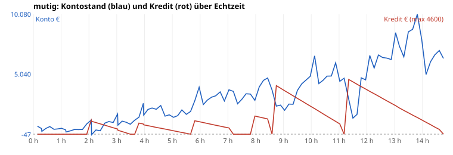
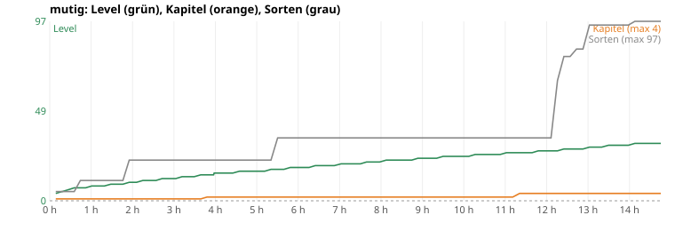
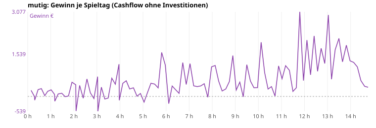


#### Je Echtzeit-Stunde

| Stunde | Spieltag (Datum) | Konto | Kredit | Gewinn/Tag Ø | Level | Kap. | Sorten | Regale | gekauft in dieser Stunde |
|---|---|---|---|---|---|---|---|---|---|
| 1 | 7 (Fr 8.10.) | 496 € | – | 173 € | 8 | 1 | 11 | 7 | Regal ×7, Liz:snacks |
| 2 | 15 (Sa 16.10.) | 1.184 € | 1.192 € | 176 € | 10 | 1 | 22 | 8 | Regal, Liz:jugend, shop_halb |
| 3 | 22 (Sa 23.10.) | 1.699 € | 433 € | 291 € | 12 | 1 | 22 | 10 | Regal ×3 |
| 4 | 31 (Mo 1.11.) | 2.080 € | 714 € | 420 € | 15 | 2 | 22 | 10 | plakat, terminal, lager, grosskunden, sackkarre |
| 5 | 37 (So 7.11.) | 1.419 € | 286 € | 178 € | 16 | 2 | 22 | 10 | heizung, musik, tag4 |
| 6 | 44 (So 14.11.) | 2.489 € | 975 € | 552 € | 18 | 2 | 34 | 10 | regallicht, Liz:zubehoer, lager_nord, gravur |
| 7 | 50 (Sa 20.11.) | 3.734 € | 525 € | 599 € | 20 | 2 | 34 | 10 | cams, radio, Team:reinigung |
| 8 | 57 (Sa 27.11.) | 3.971 € | 1.440 € | 537 € | 22 | 2 | 34 | 10 | wagen, testfeld |
| 9 | 63 (Fr 3.12.) | 2.008 € | 3.655 € | 548 € | 23 | 2 | 34 | 10 | lager_gross, Regal ×3 |
| 10 | 70 (Fr 10.12.) | 6.587 € | 2.150 € | 690 € | 24 | 2 | 34 | 10 | Team:reinigung |
| 11 | 76 (Do 16.12.) | 4.446 € | 860 € | 543 € | 26 | 2 | 34 | 10 | onlineshop, alarm |
| 12 | 83 (Do 23.12.) | 6.617 € | 3.600 € | 1.181 € | 27 | 4 | 34 | 16 | shop_gross, Regal ×6 |
| 13 | 89 (Mi 29.12.) | 8.535 € | 2.400 € | 1.635 € | 29 | 4 | 95 | 19 | Regal ×3, Liz:klassiker, Liz:partydeko, Liz:krach, Liz:kleinfeuer, Liz:buffet |
| 14 | 96 (Mi 5.1.) | 5.015 € | 1.000 € | 1.442 € | 31 | 4 | 97 | 20 | Regal, Team:reinigung, kundenkarte, Team:auffueller, Team:auffueller2, Team:kassierer, kasse2, Liz:feuerzauber |
| 15 (Teil) | 100 (So 9.1.) | 6.370 € | – | 589 € | 31 | 4 | 97 | 20 | Team:kassierer2 |

#### Meilensteine (Echtzeit h:mm)

| Zeit | Tag | Ereignis |
|---|---|---|
| 0:36 | 5 | Liz:snacks |
| 1:46 | 14 | Liz:jugend |
| 1:55 | 15 | shop_halb |
| 3:02 | 23 | plakat |
| 3:29 | 27 | terminal |
| 3:39 | 28 | lager |
| 3:48 | 28 | KAPITEL 2 |
| 3:57 | 30 | grosskunden |
| 3:57 | 30 | sackkarre |
| 4:07 | 32 | heizung |
| 4:16 | 33 | musik |
| 4:35 | 35 | tag4 |
| 5:21 | 40 | regallicht |
| 5:21 | 40 | Liz:zubehoer |
| 5:39 | 42 | lager_nord |
| 5:58 | 44 | gravur |
| 6:34 | 48 | cams |
| 6:43 | 49 | radio |
| 7:12 | 52 | wagen |
| 7:49 | 56 | testfeld |
| 8:35 | 61 | lager_gross |
| 10:07 | 71 | onlineshop |
| 10:53 | 76 | alarm |
| 11:11 | 78 | shop_gross |
| 11:21 | 78 | KAPITEL 4 |
| 12:06 | 84 | Liz:klassiker |
| 12:06 | 84 | Liz:partydeko |
| 12:16 | 85 | Liz:krach |
| 12:34 | 87 | Liz:kleinfeuer |
| 12:53 | 89 | Liz:buffet |
| 13:10 | 91 | kundenkarte |
| 13:49 | 95 | kasse2 |
| 13:58 | 96 | Liz:feuerzauber |

#### Durststrecken (> 20 Min Echtzeit ohne spürbaren Fortschritt)

Spürbar = Ausbau, Lizenz, neue Mitarbeiter, Kapitel. Level-Aufstiege und Regale zählen nicht (Level schaltet nur frei, was man sich dann noch leisten muss).

| von | bis | Dauer | Spieltage | Level dabei | Konto am Ende |
|---|---|---|---|---|---|
| 0:00 | 0:36 | 36 min | 0–4 | 4→7 | 641 € |
| 0:36 | 1:46 | 70 min | 5–13 | 7→9 | 400 € |
| 1:55 | 3:02 | 67 min | 15–22 | 10→12 | 1.699 € |
| 3:02 | 3:29 | 27 min | 23–26 | 12→13 | 834 € |
| 4:35 | 5:21 | 46 min | 35–39 | 16→17 | 2.037 € |
| 5:58 | 6:34 | 36 min | 44–47 | 18→19 | 3.225 € |
| 6:43 | 7:12 | 28 min | 49–51 | 19→20 | 3.596 € |
| 7:12 | 7:49 | 37 min | 52–55 | 20→21 | 3.371 € |
| 7:49 | 8:35 | 47 min | 56–60 | 21→22 | 3.716 € |
| 8:35 | 10:07 | 92 min | 61–70 | 22→24 | 6.587 € |
| 10:07 | 10:53 | 45 min | 71–75 | 25→25 | 6.003 € |
| 11:21 | 12:06 | 46 min | 79–83 | 26→27 | 6.617 € |
| 13:10 | 13:49 | 39 min | 91–94 | 29→30 | 10.080 € |
| 13:58 | 14:45 | 47 min | 96–100 | 31→31 | 6.370 € |

#### Geld stapelt sich (zu leicht?)

Tage, an denen das Konto mehr als das Dreifache der teuersten jetzt kaufbaren, noch offenen Sache (Ausbau/Lizenz) zeigt – oder nichts mehr zu kaufen ist.

Kein Tag.

#### Wie weit ist die nächste Fläche? (Stichproben je Stunde)

Nächste kaufbare Fläche (Level und Voraussetzung erfüllt) und die nächste, die noch am Level hängt. „Tage“ = bis das Konto den Preis zeigt, bei Ø-Gewinn der letzten 7 Tage.

| Stunde | Level | nächste kaufbare Fläche | Kosten | Konto | Tage bis bezahlbar | nächste Fläche per Level gesperrt | Level fehlen |
|---|---|---|---|---|---|---|---|
| 1 | 8 | lager | 1.200 € | 496 € | 5 | shop_gross (L11) | 3 |
| 2 | 10 | lager | 1.200 € | 1.184 € | 1 | shop_gross (L11) | 1 |
| 3 | 12 | lager | 1.200 € | 1.699 € | 0 | lager_gross (L13) | 1 |
| 4 | 15 | lager_nord | 1.900 € | 2.080 € | 0 | lager_sued (L18) | 3 |
| 5 | 16 | lager_nord | 1.900 € | 1.419 € | 3 | lager_sued (L18) | 2 |
| 6 | 18 | onlineshop | 3.200 € | 2.489 € | 2 | labor (L20) | 2 |
| 7 | 20 | onlineshop | 3.200 € | 3.734 € | 0 | shop_ost (L21) | 1 |
| 8 | 22 | onlineshop | 3.200 € | 3.971 € | 0 | shop_sued (L24) | 2 |
| 9 | 23 | onlineshop | 3.200 € | 2.008 € | 2 | shop_sued (L24) | 1 |
| 10 | 24 | onlineshop | 3.200 € | 6.587 € | 0 | lager_sued2 (L25) | 1 |
| 11 | 26 | shop_gross | 7.500 € | 4.446 € | 5 | packstation2 (L27) | 1 |
| 12 | 27 | labor | 9.800 € | 6.617 € | 3 | lager_west (L28) | 1 |
| 13 | 29 | labor | 9.800 € | 8.535 € | 1 | rampe4 (L30) | 1 |
| 14 | 31 | labor | 9.800 € | 5.015 € | 4 | – | – |
| 15 | 31 | labor | 9.800 € | 6.370 € | 4 | – | – |

#### Amortisation der Käufe (aus dem Lauf geschätzt)

Gewinn/Tag = Kontoveränderung ohne Investitionen und Kredite, saisonbereinigt (÷ Tagesfaktor dayMult). Vorher = Ø 5 offene Tage davor, nachher = Ø 7 offene Tage danach. Grob: Saison, Ereignisse und weitere Käufe in der Zeit mischen mit.

| Tag | Kauf | Kosten | Gewinn/Tag vorher | nachher | Δ/Tag | Amortisation (Spieltage ≈ Echtzeit) |
|---|---|---|---|---|---|---|
| 5 | Liz:snacks | 260 € | 222 € | 107 € | -115 € | nicht messbar |
| 14 | Liz:jugend | 60 € | 68 € | 317 € | 249 € | 0 Tage ≈ 0:02 h |
| 15 | shop_halb | 1.400 € | 144 € | 332 € | 188 € | 7 Tage ≈ 1:03 h |
| 23 | plakat | 400 € | 268 € | 347 € | 78 € | 5 Tage ≈ 0:43 h |
| 27 | terminal | 320 € | 153 € | 452 € | 298 € | 1 Tage ≈ 0:09 h |
| 28 | lager | 1.200 € | 273 € | 425 € | 152 € | 8 Tage ≈ 1:07 h |
| 30 | grosskunden | 500 € | 262 € | 264 € | 2 € | 232 Tage ≈ 32:52 h |
| 30 | sackkarre | 350 € | 262 € | 264 € | 2 € | 162 Tage ≈ 23:01 h |
| 32 | heizung | 450 € | 420 € | 178 € | -242 € | nicht messbar |
| 33 | musik | 380 € | 593 € | 211 € | -382 € | nicht messbar |
| 35 | tag4 | 900 € | 575 € | 417 € | -158 € | nicht messbar |
| 40 | regallicht | 700 € | 105 € | 467 € | 362 € | 2 Tage ≈ 0:16 h |
| 40 | Liz:zubehoer | 120 € | 105 € | 467 € | 362 € | 0 Tage ≈ 0:03 h |
| 42 | lager_nord | 1.900 € | 274 € | 468 € | 194 € | 10 Tage ≈ 1:23 h |
| 44 | gravur | 1.200 € | 810 € | 671 € | -139 € | nicht messbar |
| 48 | cams | 900 € | 290 € | 550 € | 261 € | 3 Tage ≈ 0:29 h |
| 49 | radio | 1.200 € | 379 € | 633 € | 254 € | 5 Tage ≈ 0:40 h |
| 50 | Team:reinigung (Lohn läuft mit) | 250 € | 569 € | 625 € | 56 € | 4 Tage ≈ 0:38 h |
| 52 | wagen | 1.400 € | 765 € | 644 € | -121 € | nicht messbar |
| 56 | testfeld | 3.200 € | 485 € | 696 € | 211 € | 15 Tage ≈ 2:09 h |
| 61 | lager_gross | 6.200 € | 757 € | 579 € | -177 € | nicht messbar |
| 70 | Team:reinigung (Lohn läuft mit) | 250 € | 496 € | 562 € | 65 € | 4 Tage ≈ 0:33 h |
| 71 | onlineshop | 3.200 € | 780 € | 570 € | -210 € | nicht messbar |
| 76 | alarm | 2.200 € | 511 € | 1.017 € | 506 € | 4 Tage ≈ 0:37 h |
| 78 | shop_gross | 7.500 € | 582 € | 1.069 € | 487 € | 15 Tage ≈ 2:11 h |
| 84 | Liz:klassiker | 380 € | 1.138 € | 879 € | -259 € | nicht messbar |
| 84 | Liz:partydeko | 520 € | 1.138 € | 879 € | -259 € | nicht messbar |
| 85 | Liz:krach | 1.100 € | 1.176 € | 858 € | -318 € | nicht messbar |
| 87 | Liz:kleinfeuer | 1.800 € | 1.008 € | 1.348 € | 340 € | 5 Tage ≈ 0:45 h |
| 89 | Liz:buffet | 700 € | 941 € | 1.590 € | 649 € | 1 Tage ≈ 0:09 h |
| 90 | Team:reinigung (Lohn läuft mit) | 250 € | 1.104 € | 1.751 € | 647 € | 0 Tage ≈ 0:03 h |
| 91 | kundenkarte | 2.600 € | 887 € | 1.773 € | 885 € | 3 Tage ≈ 0:25 h |
| 93 | Team:auffueller (Lohn läuft mit) | 450 € | 750 € | 1.355 € | 605 € | 1 Tage ≈ 0:06 h |
| 93 | Team:auffueller2 (Lohn läuft mit) | 600 € | 750 € | 1.355 € | 605 € | 1 Tage ≈ 0:08 h |
| 94 | Team:kassierer (Lohn läuft mit) | 600 € | 1.192 € | 1.111 € | -81 € | nicht messbar |
| 95 | kasse2 | 3.400 € | 1.495 € | 946 € | -549 € | nicht messbar |
| 96 | Liz:feuerzauber | 4.200 € | 1.838 € | 752 € | -1.086 € | nicht messbar |

#### Umsatzanteile (je 30 Spieltage)

| Tage | Feuerwerk (F1+F2) | Zubehör/Party/Essen | eigene Marke | Online-Pauschale | Versand (Pakete) | Umsatz gesamt |
|---|---|---|---|---|---|---|
| 0–29 | 76 % | 24 % | 0 % | 0 % | 0 % | 12.562 € |
| 30–59 | 62 % | 38 % | 0 % | 0 % | 0 % | 26.942 € |
| 60–89 | 44 % | 45 % | 0 % | 11 % | 0 % | 50.617 € |
| 90–100 | 53 % | 36 % | 0 % | 11 % | 0 % | 31.112 € |

<details><summary>Alle Spieltage</summary>

| Tag | Datum | Echtzeit | Umsatz | Kunden | verpasst | Ware | Gewinn | Konto | Kredit | Lvl | Kap | Ruf | Käufe |
|---|---|---|---|---|---|---|---|---|---|---|---|---|---|
| 0 | Fr 1.10. | 0:09 | 220 | 49 | 80 | 93 | 222 | 677 |  | 4 | 1 | 50 | Regal:klein |
| 1 | Sa 2.10. | 0:18 | 277 | 49 | 0 | 308 | -2 | 472 |  | 5 | 1 | 68 | Regal:klein Regal:standard |
| 2 | So 3.10. Ruhetag | 0:18 | 0 | 0 | 0 | 100 | -135 | 236 |  | 5 | 1 | 68 | Regal:klein |
| 3 | Mo 4.10. | 0:27 | 208 | 29 | 0 | 0 | 249 | 485 |  | 6 | 1 | 78 |  |
| 4 | Di 5.10. | 0:36 | 191 | 27 | 0 | 28 | 285 | 641 |  | 7 | 1 | 90 | Regal:klein |
| 5 | Mi 6.10. | 0:44 | 241 | 24 | 16 | 165 | 29 | 410 |  | 7 | 1 | 89 | Liz:snacks |
| 6 | Do 7.10. | 0:52 | 156 | 23 | 0 | 149 | 186 | 439 |  | 7 | 1 | 91 | Regal:klein |
| 7 | Fr 8.10. | 1:01 | 316 | 33 | 0 | 16 | 242 | 496 |  | 8 | 1 | 97 | Regal:klein |
| 8 | Sa 9.10. | 1:10 | 290 | 33 | 0 | 152 | 75 | 358 |  | 8 | 1 | 98 | Regal:klein |
| 9 | So 10.10. Ruhetag | 1:10 | 0 | 0 | 0 | 111 | -174 | 184 |  | 8 | 1 | 98 |  |
| 10 | Mo 11.10. | 1:19 | 155 | 19 | 0 | 0 | 92 | 276 |  | 8 | 1 | 97 |  |
| 11 | Di 12.10. | 1:29 | 217 | 26 | 0 | 33 | 117 | 393 |  | 9 | 1 | 98 |  |
| 12 | Mi 13.10. | 1:37 | 132 | 16 | 0 | 75 | -10 | 383 |  | 9 | 1 | 99 |  |
| 13 | Do 14.10. | 1:46 | 225 | 26 | 0 | 140 | 17 | 400 |  | 9 | 1 | 98 |  |
| 14 | Fr 15.10. | 1:55 | 658 | 39 | 15 | 189 | 518 | 858 |  | 10 | 1 | 99 | Liz:jugend |
| 15 | Sa 16.10. | 2:05 | 587 | 40 | 15 | 453 | 426 | 1184 | 1192 | 10 | 1 | 99 | Kredit:1300 shop_halb |
| 16 | So 17.10. Ruhetag | 2:06 | 0 | 0 | 0 | 323 | -530 | -47 | 1083 | 10 | 1 | 99 | Regal:klein Regal:standard Regal:hoch |
| 17 | Mo 18.10. | 2:15 | 612 | 41 | 1 | 0 | 401 | 354 | 975 | 11 | 1 | 90 |  |
| 18 | Di 19.10. | 2:24 | 316 | 21 | 0 | 170 | -63 | 291 | 867 | 11 | 1 | 92 |  |
| 19 | Mi 20.10. | 2:34 | 956 | 48 | 1 | 113 | 636 | 927 | 758 | 11 | 1 | 100 |  |
| 20 | Do 21.10. | 2:43 | 342 | 26 | 0 | 0 | 132 | 1059 | 650 | 12 | 1 | 100 |  |
| 21 | Fr 22.10. | 2:52 | 515 | 36 | 0 | 385 | -78 | 980 | 542 | 12 | 1 | 99 |  |
| 22 | Sa 23.10. | 3:02 | 1113 | 70 | 0 | 186 | 719 | 1699 | 433 | 12 | 1 | 100 |  |
| 23 | So 24.10. Ruhetag | 3:03 | 0 | 0 | 0 | 333 | -539 | 760 | 325 | 12 | 1 | 100 | plakat |
| 24 | Mo 25.10. | 3:12 | 698 | 33 | 0 | 153 | 336 | 1096 | 217 | 13 | 1 | 100 |  |
| 25 | Di 26.10. | 3:20 | 450 | 29 | 0 | 337 | -94 | 1002 | 108 | 13 | 1 | 100 |  |
| 26 | Mi 27.10. | 3:29 | 308 | 21 | 0 | 272 | -60 | 834 |  | 13 | 1 | 100 | Tilgung |
| 27 | Do 28.10. | 3:39 | 919 | 56 | 0 | 159 | 664 | 1178 |  | 14 | 1 | 100 | terminal |
| 28 | Fr 29.10. | 3:48 | 710 | 53 | 0 | 80 | 444 | 1422 | 929 | 14 | 2 | 85 | Kredit:1000 lager |
| 29 | Sa 30.10. | 3:57 | 1751 | 87 | 0 | 389 | 1172 | 2594 | 857 | 14 | 2 | 100 |  |
| 30 | So 31.10. Ruhetag | 3:58 | 0 | 0 | 0 | 0 | -140 | 1604 | 786 | 15 | 2 | 100 | grosskunden sackkarre |
| 31 | Mo 1.11. | 4:07 | 680 | 32 | 0 | 0 | 476 | 2080 | 714 | 15 | 2 | 95 |  |
| 32 | Di 2.11. | 4:16 | 781 | 51 | 0 | 0 | 571 | 2201 | 643 | 15 | 2 | 96 | heizung |
| 33 | Mi 3.11. | 4:25 | 486 | 30 | 0 | 0 | 272 | 2093 | 571 | 15 | 2 | 95 | musik |
| 34 | Do 4.11. | 4:35 | 668 | 38 | 0 | 130 | 315 | 2408 | 500 | 16 | 2 | 96 |  |
| 35 | Fr 5.11. | 4:44 | 496 | 35 | 0 | 257 | 10 | 1518 | 429 | 16 | 2 | 74 | tag4 |
| 36 | Sa 6.11. | 4:53 | 599 | 26 | 0 | 258 | 107 | 1625 | 357 | 16 | 2 | 45 |  |
| 37 | So 7.11. | 5:03 | 225 | 12 | 0 | 198 | -206 | 1419 | 286 | 16 | 2 | 44 |  |
| 38 | Mo 8.11. | 5:12 | 463 | 20 | 0 | 93 | 139 | 1558 | 214 | 16 | 2 | 48 |  |
| 39 | Di 9.11. | 5:21 | 845 | 39 | 0 | 132 | 479 | 2037 | 143 | 17 | 2 | 72 |  |
| 40 | Mi 10.11. | 5:30 | 1060 | 54 | 20 | 376 | 450 | 1667 | 71 | 17 | 2 | 92 | regallicht Liz:zubehoer |
| 41 | Do 11.11. | 5:39 | 906 | 39 | 3 | 434 | 312 | 1908 |  | 17 | 2 | 96 | Tilgung |
| 42 | Fr 12.11. | 5:48 | 1349 | 59 | 15 | 391 | 1601 | 2809 | 1125 | 18 | 2 | 96 | Kredit:1200 lager_nord |
| 43 | Sa 13.11. | 5:58 | 1875 | 97 | 43 | 471 | 1141 | 3950 | 1050 | 18 | 2 | 96 |  |
| 44 | So 14.11. | 6:07 | 527 | 26 | 4 | 522 | -261 | 2489 | 975 | 18 | 2 | 96 | gravur |
| 45 | Mo 15.11. | 6:16 | 652 | 36 | 10 | 0 | 380 | 2869 | 900 | 18 | 2 | 96 |  |
| 46 | Di 16.11. | 6:25 | 578 | 36 | 16 | 54 | 243 | 3112 | 825 | 19 | 2 | 96 |  |
| 47 | Mi 17.11. | 6:34 | 772 | 41 | 0 | 374 | 113 | 3225 | 750 | 19 | 2 | 96 |  |
| 48 | Do 18.11. | 6:43 | 952 | 41 | 7 | 367 | 1231 | 3556 | 675 | 19 | 2 | 96 | cams |
| 49 | Fr 19.11. | 6:52 | 1207 | 68 | 26 | 489 | 435 | 2791 | 600 | 19 | 2 | 91 | radio |
| 50 | Sa 20.11. | 7:02 | 1952 | 99 | 55 | 418 | 1193 | 3734 | 525 | 20 | 2 | 96 | Team:reinigung |
| 51 | So 21.11. | 7:12 | 943 | 50 | 9 | 337 | 387 | 3596 |  | 20 | 2 | 96 | Tilgung |
| 52 | Mo 22.11. | 7:21 | 949 | 52 | 4 | 374 | 357 | 2553 |  | 20 | 2 | 96 | wagen |
| 53 | Di 23.11. | 7:30 | 670 | 38 | 11 | 69 | 383 | 2936 |  | 20 | 2 | 93 |  |
| 54 | Mi 24.11. | 7:39 | 1027 | 43 | 3 | 341 | 463 | 3399 |  | 21 | 2 | 96 |  |
| 55 | Do 25.11. | 7:49 | 658 | 41 | 15 | 464 | -28 | 3371 |  | 21 | 2 | 96 |  |
| 56 | Fr 26.11. | 7:58 | 1845 | 96 | 58 | 404 | 1075 | 2846 | 1520 | 21 | 2 | 96 | Kredit:1600 testfeld |
| 57 | Sa 27.11. | 8:08 | 1908 | 103 | 56 | 417 | 1125 | 3971 | 1440 | 22 | 2 | 96 |  |
| 58 | So 28.11. | 8:17 | 924 | 42 | 33 | 41 | 554 | 4525 | 1360 | 22 | 2 | 96 |  |
| 59 | Mo 29.11. | 8:26 | 946 | 55 | 90 | 419 | 199 | 4724 | 1280 | 22 | 2 | 91 |  |
| 60 | Di 30.11. | 8:35 | 886 | 46 | 34 | 387 | 272 | 3716 |  | 22 | 2 | 93 | Tilgung |
| 61 | Mi 1.12. | 8:45 | 1496 | 94 | 75 | 404 | 543 | 2359 | 4085 | 22 | 2 | 96 | Kredit:4300 lager_gross |
| 62 | Do 2.12. | 8:54 | 1177 | 85 | 154 | 477 | 1487 | 2446 | 3870 | 23 | 2 | 87 | Regal:rhoch Regal:rschwer Entlassen:reinigung |
| 63 | Fr 3.12. | 9:02 | 1303 | 95 | 124 | 550 | 232 | 2008 | 3655 | 23 | 2 | 91 | Regal:rhoch |
| 64 | Sa 4.12. | 9:12 | 1638 | 83 | 64 | 600 | 520 | 2528 | 3440 | 23 | 2 | 96 |  |
| 65 | So 5.12. | 9:21 | 910 | 44 | 27 | 408 | -12 | 2516 | 3225 | 23 | 2 | 96 |  |
| 66 | Mo 6.12. | 9:30 | 1009 | 65 | 35 | 419 | 1155 | 3671 | 3010 | 24 | 2 | 96 |  |
| 67 | Di 7.12. | 9:39 | 1497 | 68 | 24 | 425 | 560 | 4231 | 2795 | 24 | 2 | 96 |  |
| 68 | Mi 8.12. | 9:48 | 1313 | 73 | 72 | 491 | 315 | 4546 | 2580 | 24 | 2 | 95 |  |
| 69 | Do 9.12. | 9:58 | 1398 | 76 | 44 | 573 | 321 | 4867 | 2365 | 24 | 2 | 96 |  |
| 70 | Fr 10.12. | 10:07 | 1967 | 101 | 63 | 559 | 1970 | 6587 | 2150 | 24 | 2 | 96 | Team:reinigung |
| 71 | Sa 11.12. | 10:16 | 1735 | 104 | 59 | 606 | 866 | 4253 | 1935 | 25 | 2 | 96 | onlineshop |
| 72 | So 12.12. | 10:25 | 861 | 55 | 55 | 367 | 268 | 4521 | 1720 | 25 | 2 | 92 |  |
| 73 | Mo 13.12. | 10:34 | 867 | 55 | 67 | 288 | 358 | 4879 | 1505 | 25 | 2 | 94 |  |
| 74 | Di 14.12. | 10:43 | 575 | 34 | 25 | 345 | 14 | 4893 | 1290 | 25 | 2 | 95 |  |
| 75 | Mi 15.12. | 10:53 | 1844 | 95 | 93 | 486 | 1110 | 6003 | 1075 | 25 | 2 | 96 |  |
| 76 | Do 16.12. | 11:02 | 1455 | 92 | 88 | 567 | 643 | 4446 | 860 | 26 | 2 | 96 | alarm |
| 77 | Fr 17.12. | 11:11 | 1763 | 102 | 95 | 632 | 1118 | 4704 |  | 26 | 2 | 96 | Tilgung |
| 78 | Sa 18.12. | 11:21 | 1779 | 99 | 89 | 535 | 949 | 2953 | 4600 | 26 | 4 | 96 | Kredit:4800 shop_gross |
| 79 | So 19.12. | 11:30 | 837 | 61 | 79 | 344 | 183 | 1347 | 4400 | 26 | 4 | 95 | Regal:klein Regal:standard Regal:hoch Regal:kuehl Regal:gondel |
| 80 | Mo 20.12. | 11:39 | 1013 | 57 | 38 | 406 | 317 | 1664 | 4200 | 26 | 4 | 96 | Entlassen:reinigung |
| 81 | Di 21.12. | 11:48 | 1638 | 94 | 80 | 471 | 3077 | 4741 | 4000 | 27 | 4 | 94 |  |
| 82 | Mi 22.12. | 11:57 | 1272 | 92 | 107 | 398 | 576 | 4567 | 3800 | 27 | 4 | 96 | Regal:gondel |
| 83 | Do 23.12. | 12:06 | 1759 | 87 | 122 | 696 | 2050 | 6617 | 3600 | 27 | 4 | 90 |  |
| 84 | Fr 24.12. | 12:16 | 1793 | 94 | 154 | 694 | 786 | 5563 | 3400 | 27 | 4 | 90 | Regal:gondel Liz:klassiker Liz:partydeko |
| 85 | Sa 25.12. | 12:25 | 1924 | 102 | 119 | 794 | 2200 | 6663 | 3200 | 28 | 4 | 96 | Liz:krach |
| 86 | So 26.12. | 12:34 | 1820 | 90 | 188 | 582 | 912 | 6445 | 3000 | 28 | 4 | 87 | Regal:gondel |
| 87 | Mo 27.12. | 12:43 | 2397 | 94 | 244 | 910 | 1750 | 6395 | 2800 | 28 | 4 | 77 | Liz:kleinfeuer |
| 88 | Di 28.12. | 12:53 | 2556 | 94 | 104 | 1039 | 1198 | 6273 | 2600 | 28 | 4 | 96 | Regal:gondel |
| 89 | Mi 29.12. | 13:02 | 2511 | 98 | 125 | 1234 | 2962 | 8535 | 2400 | 29 | 4 | 96 | Liz:buffet |
| 90 | Do 30.12. | 13:10 | 3145 | 78 | 19 | 2145 | 625 | 7400 | 2200 | 29 | 4 | 100 | Regal:gondel Team:reinigung |
| 91 | Fr 31.12. | 13:20 | 4918 | 91 | 36 | 2923 | 1699 | 6499 | 2000 | 29 | 4 | 96 | kundenkarte |
| 92 | Sa 1.1. | 13:30 | 3702 | 96 | 18 | 1218 | 2110 | 8608 | 1800 | 30 | 4 | 96 |  |
| 93 | So 2.1. | 13:39 | 2468 | 72 | 14 | 637 | 1259 | 8817 | 1600 | 30 | 4 | 96 | Team:auffueller Team:auffueller2 |
| 94 | Mo 3.1. | 13:49 | 2895 | 92 | 55 | 486 | 1863 | 10080 | 1400 | 30 | 4 | 96 | Team:kassierer |
| 95 | Di 4.1. | 13:58 | 2122 | 82 | 58 | 385 | 1296 | 7976 | 1200 | 30 | 4 | 96 | kasse2 |
| 96 | Mi 5.1. | 14:08 | 1959 | 86 | 95 | 283 | 1239 | 5015 | 1000 | 31 | 4 | 96 | Liz:feuerzauber |
| 97 | Do 6.1. | 14:17 | 1842 | 93 | 117 | 334 | 1074 | 6089 | 800 | 31 | 4 | 96 |  |
| 98 | Fr 7.1. | 14:27 | 1868 | 95 | 202 | 519 | 578 | 6667 | 600 | 31 | 4 | 76 |  |
| 99 | Sa 8.1. | 14:36 | 1679 | 108 | 212 | 513 | 369 | 7036 | 400 | 31 | 4 | 57 |  |
| 100 | So 9.1. | 14:45 | 1240 | 78 | 194 | 447 | 334 | 6370 |  | 31 | 4 | 32 | Team:kassierer2 Tilgung |

</details>


**Kurz „mutig“:** tiefster Kontostand -47 €, 1 von 101 Tagen im Minus, tiefster Ruf 32. Ende: Konto 6.370 €, Kredit 0 €, Level 31, Kapitel 4.


### Lauf „teuer“: 60 Spieltage = 7:15 h Echtzeit

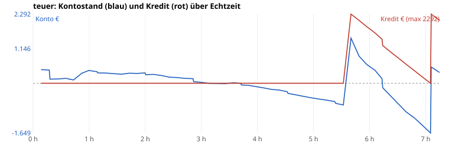
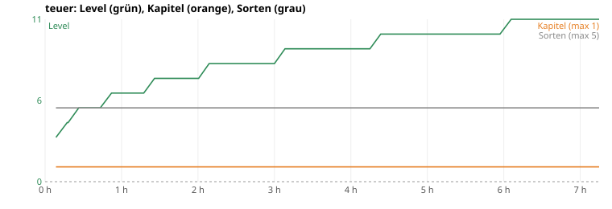
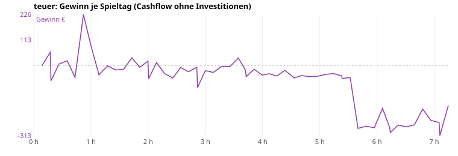


#### Je Echtzeit-Stunde

| Stunde | Spieltag (Datum) | Konto | Kredit | Gewinn/Tag Ø | Level | Kap. | Sorten | Regale | gekauft in dieser Stunde |
|---|---|---|---|---|---|---|---|---|---|
| 1 | 8 (Sa 9.10.) | 382 € | – | 38 € | 6 | 1 | 5 | 4 | Regal ×4 |
| 2 | 16 (So 17.10.) | 283 € | – | 0 € | 7 | 1 | 5 | 4 | – |
| 3 | 24 (Mo 25.10.) | 30 € | – | -22 € | 8 | 1 | 5 | 4 | – |
| 4 | 33 (Mi 3.11.) | -155 € | – | -17 € | 9 | 1 | 5 | 4 | – |
| 5 | 41 (Do 11.11.) | -523 € | – | -44 € | 10 | 1 | 5 | 4 | – |
| 6 | 49 (Fr 19.11.) | 428 € | 1.667 € | -166 € | 11 | 1 | 5 | 6 | Regal ×2 |
| 7 | 57 (Sa 27.11.) | -1.649 € | – | -254 € | 11 | 1 | 5 | 6 | – |
| 8 (Teil) | 59 (Mo 29.11.) | 359 € | 2.083 € | -179 € | 11 | 1 | 5 | 6 | – |

#### Meilensteine (Echtzeit h:mm)

| Zeit | Tag | Ereignis |
|---|---|---|

#### Durststrecken (> 20 Min Echtzeit ohne spürbaren Fortschritt)

Spürbar = Ausbau, Lizenz, neue Mitarbeiter, Kapitel. Level-Aufstiege und Regale zählen nicht (Level schaltet nur frei, was man sich dann noch leisten muss).

| von | bis | Dauer | Spieltage | Level dabei | Konto am Ende |
|---|---|---|---|---|---|
| 0:00 | 7:15 | 435 min | 0–59 | 3→11 | 359 € |

#### Geld stapelt sich (zu leicht?)

Tage, an denen das Konto mehr als das Dreifache der teuersten jetzt kaufbaren, noch offenen Sache (Ausbau/Lizenz) zeigt – oder nichts mehr zu kaufen ist.

Kein Tag.

#### Wie weit ist die nächste Fläche? (Stichproben je Stunde)

Nächste kaufbare Fläche (Level und Voraussetzung erfüllt) und die nächste, die noch am Level hängt. „Tage“ = bis das Konto den Preis zeigt, bei Ø-Gewinn der letzten 7 Tage.

| Stunde | Level | nächste kaufbare Fläche | Kosten | Konto | Tage bis bezahlbar | nächste Fläche per Level gesperrt | Level fehlen |
|---|---|---|---|---|---|---|---|
| 1 | 6 | lager | 1.200 € | 382 € | 21 | lager_nord (L8) | 2 |
| 2 | 7 | lager | 1.200 € | 283 € | ∞ | lager_nord (L8) | 1 |
| 3 | 8 | lager | 1.200 € | 30 € | ∞ | shop_gross (L11) | 3 |
| 4 | 9 | lager | 1.200 € | -155 € | ∞ | shop_gross (L11) | 2 |
| 5 | 10 | lager | 1.200 € | -523 € | ∞ | shop_gross (L11) | 1 |
| 6 | 11 | lager | 1.200 € | 428 € | ∞ | lager_gross (L13) | 2 |
| 7 | 11 | lager | 1.200 € | -1.649 € | ∞ | lager_gross (L13) | 2 |
| 8 | 11 | lager | 1.200 € | 359 € | ∞ | lager_gross (L13) | 2 |

#### Amortisation der Käufe (aus dem Lauf geschätzt)

Gewinn/Tag = Kontoveränderung ohne Investitionen und Kredite, saisonbereinigt (÷ Tagesfaktor dayMult). Vorher = Ø 5 offene Tage davor, nachher = Ø 7 offene Tage danach. Grob: Saison, Ereignisse und weitere Käufe in der Zeit mischen mit.

| Tag | Kauf | Kosten | Gewinn/Tag vorher | nachher | Δ/Tag | Amortisation (Spieltage ≈ Echtzeit) |
|---|---|---|---|---|---|---|

#### Umsatzanteile (je 30 Spieltage)

| Tage | Feuerwerk (F1+F2) | Zubehör/Party/Essen | eigene Marke | Online-Pauschale | Versand (Pakete) | Umsatz gesamt |
|---|---|---|---|---|---|---|
| 0–29 | 100 % | 0 % | 0 % | 0 % | 0 % | 1.382 € |
| 30–59 | 100 % | 0 % | 0 % | 0 % | 0 % | 777 € |

<details><summary>Alle Spieltage</summary>

| Tag | Datum | Echtzeit | Umsatz | Kunden | verpasst | Ware | Gewinn | Konto | Kredit | Lvl | Kap | Ruf | Käufe |
|---|---|---|---|---|---|---|---|---|---|---|---|---|---|
| 0 | Fr 1.10. | 0:09 | 105 | 32 | 49 | 94 | -3 | 452 |  | 3 | 1 | 32 | Regal:klein |
| 1 | Sa 2.10. | 0:17 | 180 | 29 | 0 | 104 | 58 | 437 |  | 4 | 1 | 29 | Regal:klein |
| 2 | So 3.10. Ruhetag | 0:18 | 0 | 0 | 0 | 38 | -69 | 137 |  | 4 | 1 | 29 | Regal:klein Regal:standard |
| 3 | Mo 4.10. | 0:26 | 36 | 10 | 0 | 0 | 5 | 142 |  | 5 | 1 | 25 |  |
| 4 | Di 5.10. | 0:35 | 55 | 13 | 0 | 0 | 20 | 162 |  | 5 | 1 | 24 |  |
| 5 | Mi 6.10. | 0:43 | 54 | 7 | 0 | 74 | -54 | 108 |  | 5 | 1 | 27 |  |
| 6 | Do 7.10. | 0:52 | 81 | 12 | 0 | 0 | 226 | 334 |  | 6 | 1 | 17 |  |
| 7 | Fr 8.10. | 1:00 | 70 | 9 | 0 | 0 | 91 | 425 |  | 6 | 1 | 13 |  |
| 8 | Sa 9.10. | 1:08 | 42 | 7 | 0 | 47 | -43 | 382 |  | 6 | 1 | 12 |  |
| 9 | So 10.10. Ruhetag | 1:09 | 0 | 0 | 0 | 0 | -39 | 343 |  | 6 | 1 | 12 |  |
| 10 | Mo 11.10. | 1:17 | 36 | 8 | 0 | 0 | -3 | 340 |  | 6 | 1 | 9 |  |
| 11 | Di 12.10. | 1:26 | 55 | 9 | 0 | 32 | -21 | 319 |  | 7 | 1 | 8 |  |
| 12 | Mi 13.10. | 1:34 | 24 | 4 | 0 | 0 | -18 | 301 |  | 7 | 1 | 3 |  |
| 13 | Do 14.10. | 1:43 | 52 | 10 | 0 | 46 | 33 | 334 |  | 7 | 1 | 1 |  |
| 14 | Fr 15.10. | 1:51 | 62 | 11 | 0 | 28 | -9 | 325 |  | 7 | 1 | 3 |  |
| 15 | Sa 16.10. | 2:00 | 61 | 9 | 0 | 0 | 18 | 343 |  | 7 | 1 | 0 |  |
| 16 | So 17.10. Ruhetag | 2:01 | 0 | 0 | 0 | 17 | -60 | 283 |  | 7 | 1 | 0 |  |
| 17 | Mo 18.10. | 2:09 | 55 | 7 | 0 | 0 | 12 | 295 |  | 8 | 1 | 0 |  |
| 18 | Di 19.10. | 2:17 | 35 | 7 | 0 | 25 | -37 | 258 |  | 8 | 1 | 4 |  |
| 19 | Mi 20.10. | 2:26 | 28 | 6 | 0 | 39 | -57 | 201 |  | 8 | 1 | 2 |  |
| 20 | Do 21.10. | 2:34 | 37 | 6 | 0 | 0 | -10 | 191 |  | 8 | 1 | 1 |  |
| 21 | Fr 22.10. | 2:42 | 18 | 2 | 0 | 0 | -29 | 162 |  | 8 | 1 | 0 |  |
| 22 | Sa 23.10. | 2:51 | 56 | 16 | 0 | 17 | -9 | 153 |  | 8 | 1 | 2 |  |
| 23 | So 24.10. Ruhetag | 2:52 | 0 | 0 | 0 | 52 | -99 | 54 |  | 8 | 1 | 2 |  |
| 24 | Mo 25.10. | 3:00 | 23 | 5 | 0 | 0 | -24 | 30 |  | 8 | 1 | 0 |  |
| 25 | Di 26.10. | 3:08 | 15 | 3 | 0 | 0 | -32 | -2 |  | 9 | 1 | 0 |  |
| 26 | Mi 27.10. | 3:17 | 45 | 8 | 0 | 0 | -6 | -8 |  | 9 | 1 | 2 |  |
| 27 | Do 28.10. | 3:26 | 45 | 8 | 0 | 0 | -6 | -14 |  | 9 | 1 | 0 |  |
| 28 | Fr 29.10. | 3:35 | 83 | 13 | 0 | 0 | 32 | 18 |  | 9 | 1 | 0 |  |
| 29 | Sa 30.10. | 3:42 | 29 | 9 | 0 | 0 | -22 | -4 |  | 9 | 1 | 1 |  |
| 30 | So 31.10. Ruhetag | 3:43 | 0 | 0 | 0 | 0 | -51 | -55 |  | 9 | 1 | 0 |  |
| 31 | Mo 1.11. | 3:51 | 33 | 6 | 5 | 0 | -18 | -73 |  | 9 | 1 | 1 |  |
| 32 | Di 2.11. | 4:00 | 8 | 3 | 3 | 0 | -44 | -117 |  | 9 | 1 | 0 |  |
| 33 | Mi 3.11. | 4:07 | 14 | 3 | 3 | 0 | -38 | -155 |  | 9 | 1 | 0 |  |
| 34 | Do 4.11. | 4:15 | 3 | 1 | 4 | 0 | -48 | -203 |  | 9 | 1 | 0 |  |
| 35 | Fr 5.11. | 4:23 | 29 | 10 | 32 | 0 | -23 | -227 |  | 10 | 1 | 0 |  |
| 36 | Sa 6.11. | 4:32 | 4 | 2 | 63 | 0 | -52 | -279 |  | 10 | 1 | 0 |  |
| 37 | So 7.11. Ruhetag | 4:33 | 0 | 0 | 0 | 0 | -57 | -336 |  | 10 | 1 | 0 |  |
| 38 | Mo 8.11. | 4:41 | 11 | 3 | 33 | 0 | -46 | -382 |  | 10 | 1 | 0 |  |
| 39 | Di 9.11. | 4:49 | 6 | 3 | 15 | 0 | -51 | -433 |  | 10 | 1 | 0 |  |
| 40 | Mi 10.11. | 4:58 | 8 | 3 | 27 | 0 | -49 | -482 |  | 10 | 1 | 0 |  |
| 41 | Do 11.11. | 5:06 | 17 | 6 | 62 | 0 | -41 | -523 |  | 10 | 1 | 0 |  |
| 42 | Fr 12.11. | 5:14 | 21 | 7 | 50 | 0 | -37 | -560 |  | 10 | 1 | 0 |  |
| 43 | Sa 13.11. | 5:23 | 11 | 3 | 44 | 0 | -47 | -607 |  | 10 | 1 | 0 |  |
| 44 | So 14.11. Ruhetag | 5:24 | 0 | 0 | 0 | 0 | -59 | -666 |  | 10 | 1 | 2 |  |
| 45 | Mo 15.11. | 5:32 | 4 | 1 | 35 | 0 | -55 | -721 |  | 10 | 1 | 0 |  |
| 46 | Di 16.11. | 5:40 | 14 | 2 | 0 | 0 | -281 | 1498 | 2292 | 10 | 1 | 0 | Notkredit |
| 47 | Mi 17.11. | 5:49 | 35 | 7 | 0 | 0 | -271 | 898 | 2083 | 10 | 1 | 1 | Regal:klein Regal:standard |
| 48 | Do 18.11. | 5:57 | 25 | 5 | 0 | 0 | -278 | 620 | 1875 | 10 | 1 | 0 |  |
| 49 | Fr 19.11. | 6:06 | 113 | 17 | 0 | 0 | -192 | 428 | 1667 | 11 | 1 | 3 |  |
| 50 | Sa 20.11. | 6:13 | 26 | 7 | 0 | 0 | -277 | 151 | 1458 | 11 | 1 | 2 |  |
| 51 | So 21.11. Ruhetag | 6:14 | 0 | 0 | 0 | 0 | -299 | -148 | 1250 | 11 | 1 | 2 |  |
| 52 | Mo 22.11. | 6:22 | 31 | 4 | 0 | 0 | -266 | -414 | 1042 | 11 | 1 | 0 |  |
| 53 | Di 23.11. | 6:31 | 22 | 4 | 0 | 0 | -274 | -688 | 833 | 11 | 1 | 0 |  |
| 54 | Mi 24.11. | 6:39 | 29 | 7 | 0 | 0 | -265 | -954 | 625 | 11 | 1 | 0 |  |
| 55 | Do 25.11. | 6:48 | 99 | 12 | 5 | 0 | -195 | -1149 | 417 | 11 | 1 | 2 |  |
| 56 | Fr 26.11. | 6:56 | 47 | 11 | 11 | 0 | -245 | -1394 | 208 | 11 | 1 | 0 |  |
| 57 | Sa 27.11. | 7:05 | 37 | 10 | 36 | 0 | -255 | -1649 |  | 11 | 1 | 0 |  |
| 58 | So 28.11. Ruhetag | 7:06 | 0 | 0 | 0 | 0 | -313 | 538 | 2292 | 11 | 1 | 0 | Notkredit |
| 59 | Mo 29.11. | 7:15 | 131 | 11 | 0 | 0 | -179 | 359 | 2083 | 11 | 1 | 2 |  |

</details>


**Kurz „teuer“:** tiefster Kontostand -1.649 €, 27 von 60 Tagen im Minus, tiefster Ruf 0. Ende: Konto 359 €, Kredit 2.083 €, Level 11, Kapitel 1.


### Lauf „schlecht“: 63 Spieltage = 7:45 h Echtzeit

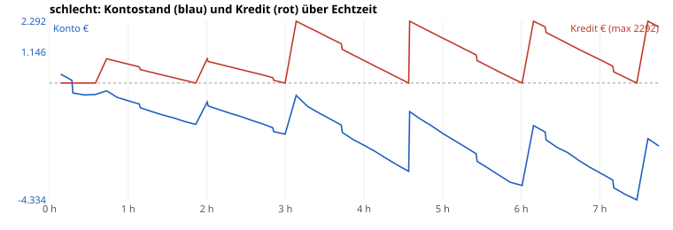
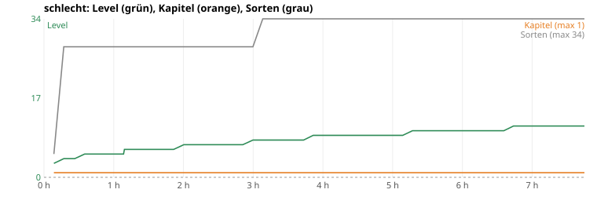
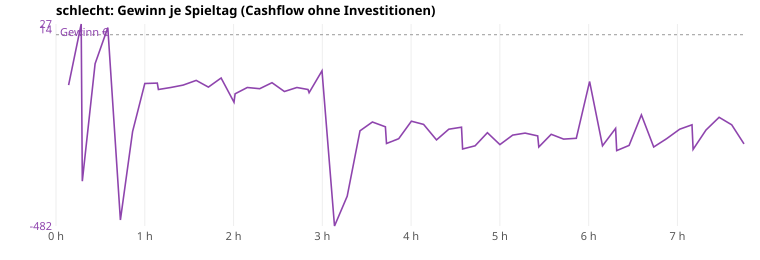


#### Je Echtzeit-Stunde

| Stunde | Spieltag (Datum) | Konto | Kredit | Gewinn/Tag Ø | Level | Kap. | Sorten | Regale | gekauft in dieser Stunde |
|---|---|---|---|---|---|---|---|---|---|
| 1 | 8 (Sa 9.10.) | -779 € | 600 € | -139 € | 5 | 1 | 28 | 3 | Regal ×3, Liz:jugend, Liz:zubehoer, plakat |
| 2 | 15 (Sa 16.10.) | -703 € | 900 € | -131 € | 7 | 1 | 28 | 3 | – |
| 3 | 25 (Di 26.10.) | -456 € | 2.292 € | -172 € | 8 | 1 | 34 | 3 | terminal, Liz:snacks |
| 4 | 32 (Di 2.11.) | -2.312 € | 833 € | -263 € | 9 | 1 | 34 | 3 | – |
| 5 | 40 (Mi 10.11.) | -1.866 € | 1.667 € | -252 € | 9 | 1 | 34 | 3 | – |
| 6 | 48 (Do 18.11.) | -3.798 € | – | -236 € | 10 | 1 | 34 | 3 | – |
| 7 | 56 (Fr 26.11.) | -3.370 € | 833 € | -254 € | 11 | 1 | 34 | 3 | – |
| 8 (Teil) | 62 (Do 2.12.) | -2.336 € | 2.083 € | -235 € | 11 | 1 | 34 | 3 | – |

#### Meilensteine (Echtzeit h:mm)

| Zeit | Tag | Ereignis |
|---|---|---|
| 0:08 | 1 | Liz:jugend |
| 0:08 | 1 | Liz:zubehoer |
| 0:35 | 5 | plakat |
| 3:00 | 25 | terminal |
| 3:00 | 25 | Liz:snacks |

#### Durststrecken (> 20 Min Echtzeit ohne spürbaren Fortschritt)

Spürbar = Ausbau, Lizenz, neue Mitarbeiter, Kapitel. Level-Aufstiege und Regale zählen nicht (Level schaltet nur frei, was man sich dann noch leisten muss).

| von | bis | Dauer | Spieltage | Level dabei | Konto am Ende |
|---|---|---|---|---|---|
| 0:08 | 0:35 | 27 min | 0–4 | 3→5 | -423 € |
| 0:35 | 3:00 | 145 min | 5–24 | 5→8 | -1.894 € |
| 3:00 | 7:45 | 285 min | 25–62 | 8→11 | -2.336 € |

#### Geld stapelt sich (zu leicht?)

Tage, an denen das Konto mehr als das Dreifache der teuersten jetzt kaufbaren, noch offenen Sache (Ausbau/Lizenz) zeigt – oder nichts mehr zu kaufen ist.

Kein Tag.

#### Wie weit ist die nächste Fläche? (Stichproben je Stunde)

Nächste kaufbare Fläche (Level und Voraussetzung erfüllt) und die nächste, die noch am Level hängt. „Tage“ = bis das Konto den Preis zeigt, bei Ø-Gewinn der letzten 7 Tage.

| Stunde | Level | nächste kaufbare Fläche | Kosten | Konto | Tage bis bezahlbar | nächste Fläche per Level gesperrt | Level fehlen |
|---|---|---|---|---|---|---|---|
| 1 | 5 | shop_halb | 1.400 € | -779 € | ∞ | lager (L6) | 1 |
| 2 | 7 | lager | 1.200 € | -703 € | ∞ | lager_nord (L8) | 1 |
| 3 | 8 | lager | 1.200 € | -456 € | ∞ | shop_gross (L11) | 3 |
| 4 | 9 | lager | 1.200 € | -2.312 € | ∞ | shop_gross (L11) | 2 |
| 5 | 9 | lager | 1.200 € | -1.866 € | ∞ | shop_gross (L11) | 2 |
| 6 | 10 | lager | 1.200 € | -3.798 € | ∞ | shop_gross (L11) | 1 |
| 7 | 11 | lager | 1.200 € | -3.370 € | ∞ | lager_gross (L13) | 2 |
| 8 | 11 | lager | 1.200 € | -2.336 € | ∞ | lager_gross (L13) | 2 |

#### Amortisation der Käufe (aus dem Lauf geschätzt)

Gewinn/Tag = Kontoveränderung ohne Investitionen und Kredite, saisonbereinigt (÷ Tagesfaktor dayMult). Vorher = Ø 5 offene Tage davor, nachher = Ø 7 offene Tage danach. Grob: Saison, Ereignisse und weitere Käufe in der Zeit mischen mit.

| Tag | Kauf | Kosten | Gewinn/Tag vorher | nachher | Δ/Tag | Amortisation (Spieltage ≈ Echtzeit) |
|---|---|---|---|---|---|---|
| 5 | plakat | 400 € | -40 € | -156 € | -116 € | nicht messbar |
| 25 | terminal | 320 € | -129 € | -275 € | -146 € | nicht messbar |
| 25 | Liz:snacks | 260 € | -129 € | -275 € | -146 € | nicht messbar |

#### Umsatzanteile (je 30 Spieltage)

| Tage | Feuerwerk (F1+F2) | Zubehör/Party/Essen | eigene Marke | Online-Pauschale | Versand (Pakete) | Umsatz gesamt |
|---|---|---|---|---|---|---|
| 0–29 | 52 % | 48 % | 0 % | 0 % | 0 % | 619 € |
| 30–59 | 39 % | 61 % | 0 % | 0 % | 0 % | 822 € |
| 60–62 | 38 % | 63 % | 0 % | 0 % | 0 % | 176 € |

<details><summary>Alle Spieltage</summary>

| Tag | Datum | Echtzeit | Umsatz | Kunden | verpasst | Ware | Gewinn | Konto | Kredit | Lvl | Kap | Ruf | Käufe |
|---|---|---|---|---|---|---|---|---|---|---|---|---|---|
| 0 | Fr 1.10. | 0:08 | 71 | 21 | 60 | 184 | -127 | 328 |  | 3 | 1 | 23 | Regal:klein |
| 1 | Sa 2.10. | 0:17 | 44 | 12 | 66 | 0 | 27 | 102 |  | 4 | 1 | 0 | Regal:klein Liz:jugend Liz:zubehoer |
| 2 | So 3.10. Ruhetag | 0:18 | 0 | 0 | 0 | 344 | -369 | -368 |  | 4 | 1 | 0 | Regal:klein |
| 3 | Mo 4.10. | 0:26 | 0 | 0 | 21 | 49 | -73 | -441 |  | 4 | 1 | 0 |  |
| 4 | Di 5.10. | 0:35 | 43 | 5 | 32 | 0 | 18 | -423 |  | 5 | 1 | 0 |  |
| 5 | Mi 6.10. | 0:43 | 18 | 4 | 15 | 346 | -467 | -290 | 900 | 5 | 1 | 0 | plakat |
| 6 | Do 7.10. | 0:52 | 13 | 3 | 37 | 217 | -244 | -534 | 800 | 5 | 1 | 0 |  |
| 7 | Fr 8.10. | 1:00 | 16 | 1 | 31 | 0 | -123 | -657 | 700 | 5 | 1 | 0 |  |
| 8 | Sa 9.10. | 1:08 | 17 | 2 | 29 | 0 | -122 | -779 | 600 | 5 | 1 | 0 |  |
| 9 | So 10.10. Ruhetag | 1:09 | 0 | 0 | 0 | 0 | -138 | -917 | 500 | 6 | 1 | 0 |  |
| 10 | Mo 11.10. | 1:18 | 8 | 2 | 24 | 0 | -133 | -1050 | 400 | 6 | 1 | 0 |  |
| 11 | Di 12.10. | 1:26 | 14 | 2 | 20 | 0 | -127 | -1177 | 300 | 6 | 1 | 0 |  |
| 12 | Mi 13.10. | 1:35 | 26 | 5 | 50 | 0 | -115 | -1292 | 200 | 6 | 1 | 0 |  |
| 13 | Do 14.10. | 1:43 | 8 | 2 | 26 | 0 | -132 | -1424 | 100 | 6 | 1 | 0 |  |
| 14 | Fr 15.10. | 1:52 | 31 | 4 | 33 | 0 | -109 | -1533 |  | 6 | 1 | 0 |  |
| 15 | Sa 16.10. | 2:00 | 12 | 3 | 40 | 37 | -170 | -703 | 900 | 7 | 1 | 0 | Notkredit |
| 16 | So 17.10. Ruhetag | 2:01 | 0 | 0 | 0 | 0 | -149 | -852 | 800 | 7 | 1 | 0 |  |
| 17 | Mo 18.10. | 2:09 | 16 | 3 | 30 | 0 | -133 | -985 | 700 | 7 | 1 | 0 |  |
| 18 | Di 19.10. | 2:18 | 11 | 4 | 31 | 0 | -136 | -1121 | 600 | 7 | 1 | 0 |  |
| 19 | Mi 20.10. | 2:26 | 27 | 5 | 27 | 0 | -121 | -1242 | 500 | 7 | 1 | 0 |  |
| 20 | Do 21.10. | 2:34 | 4 | 1 | 13 | 0 | -143 | -1385 | 400 | 7 | 1 | 0 |  |
| 21 | Fr 22.10. | 2:43 | 14 | 4 | 30 | 0 | -133 | -1519 | 300 | 7 | 1 | 0 |  |
| 22 | Sa 23.10. | 2:50 | 9 | 4 | 24 | 0 | -138 | -1657 | 200 | 7 | 1 | 0 |  |
| 23 | So 24.10. Ruhetag | 2:51 | 0 | 0 | 0 | 0 | -146 | -1803 | 100 | 7 | 1 | 0 |  |
| 24 | Mo 25.10. | 3:00 | 59 | 8 | 33 | 0 | -91 | -1894 |  | 8 | 1 | 1 |  |
| 25 | Di 26.10. | 3:08 | 16 | 3 | 25 | 288 | -482 | -456 | 2292 | 8 | 1 | 0 | terminal Liz:snacks |
| 26 | Mi 27.10. | 3:17 | 6 | 2 | 37 | 213 | -407 | -863 | 2083 | 8 | 1 | 0 |  |
| 27 | Do 28.10. | 3:25 | 36 | 7 | 62 | 0 | -242 | -1105 | 1875 | 8 | 1 | 0 |  |
| 28 | Fr 29.10. | 3:34 | 57 | 9 | 57 | 0 | -220 | -1325 | 1667 | 8 | 1 | 0 |  |
| 29 | Sa 30.10. | 3:43 | 44 | 8 | 94 | 0 | -232 | -1557 | 1458 | 8 | 1 | 1 |  |
| 30 | So 31.10. Ruhetag | 3:43 | 0 | 0 | 0 | 0 | -274 | -1832 | 1250 | 8 | 1 | 0 |  |
| 31 | Mo 1.11. | 3:52 | 11 | 2 | 36 | 0 | -262 | -2094 | 1042 | 9 | 1 | 0 |  |
| 32 | Di 2.11. | 4:00 | 58 | 8 | 46 | 0 | -218 | -2312 | 833 | 9 | 1 | 0 |  |
| 33 | Mi 3.11. | 4:08 | 49 | 5 | 33 | 0 | -226 | -2538 | 625 | 9 | 1 | 0 |  |
| 34 | Do 4.11. | 4:17 | 9 | 2 | 32 | 0 | -265 | -2803 | 417 | 9 | 1 | 1 |  |
| 35 | Fr 5.11. | 4:25 | 34 | 7 | 58 | 0 | -238 | -3041 | 208 | 9 | 1 | 0 |  |
| 36 | Sa 6.11. | 4:34 | 37 | 5 | 38 | 0 | -233 | -3274 |  | 9 | 1 | 0 |  |
| 37 | So 7.11. Ruhetag | 4:35 | 0 | 0 | 0 | 0 | -288 | -1062 | 2292 | 9 | 1 | 0 | Notkredit |
| 38 | Mo 8.11. | 4:43 | 7 | 2 | 21 | 0 | -280 | -1342 | 2083 | 9 | 1 | 0 |  |
| 39 | Di 9.11. | 4:52 | 38 | 9 | 39 | 0 | -247 | -1589 | 1875 | 9 | 1 | 0 |  |
| 40 | Mi 10.11. | 5:00 | 7 | 3 | 34 | 0 | -277 | -1866 | 1667 | 9 | 1 | 0 |  |
| 41 | Do 11.11. | 5:09 | 30 | 4 | 34 | 0 | -253 | -2119 | 1458 | 9 | 1 | 0 |  |
| 42 | Fr 12.11. | 5:17 | 33 | 4 | 45 | 0 | -248 | -2367 | 1250 | 10 | 1 | 0 |  |
| 43 | Sa 13.11. | 5:26 | 30 | 5 | 56 | 0 | -255 | -2622 | 1042 | 10 | 1 | 0 |  |
| 44 | So 14.11. Ruhetag | 5:26 | 0 | 0 | 0 | 0 | -283 | -2905 | 833 | 10 | 1 | 0 |  |
| 45 | Mo 15.11. | 5:35 | 31 | 8 | 56 | 0 | -251 | -3156 | 625 | 10 | 1 | 0 |  |
| 46 | Di 16.11. | 5:43 | 19 | 3 | 27 | 0 | -263 | -3419 | 417 | 10 | 1 | 0 |  |
| 47 | Mi 17.11. | 5:52 | 19 | 5 | 31 | 0 | -261 | -3680 | 208 | 10 | 1 | 0 |  |
| 48 | Do 18.11. | 6:01 | 40 | 9 | 31 | 0 | -118 | -3798 |  | 10 | 1 | 1 |  |
| 49 | Fr 19.11. | 6:09 | 14 | 4 | 50 | 0 | -280 | -1578 | 2292 | 10 | 1 | 1 | Notkredit |
| 50 | Sa 20.11. | 6:18 | 57 | 9 | 44 | 0 | -236 | -1814 | 2083 | 10 | 1 | 0 |  |
| 51 | So 21.11. Ruhetag | 6:19 | 0 | 0 | 0 | 0 | -292 | -2106 | 1875 | 10 | 1 | 0 |  |
| 52 | Mo 22.11. | 6:27 | 13 | 2 | 20 | 0 | -279 | -2385 | 1667 | 10 | 1 | 0 |  |
| 53 | Di 23.11. | 6:36 | 88 | 9 | 58 | 0 | -202 | -2587 | 1458 | 10 | 1 | 0 |  |
| 54 | Mi 24.11. | 6:44 | 6 | 2 | 25 | 0 | -283 | -2870 | 1250 | 11 | 1 | 0 |  |
| 55 | Do 25.11. | 6:53 | 30 | 5 | 53 | 0 | -262 | -3132 | 1042 | 11 | 1 | 1 |  |
| 56 | Fr 26.11. | 7:02 | 52 | 8 | 54 | 0 | -238 | -3370 | 833 | 11 | 1 | 1 |  |
| 57 | Sa 27.11. | 7:10 | 62 | 9 | 62 | 0 | -227 | -3597 | 625 | 11 | 1 | 0 |  |
| 58 | So 28.11. Ruhetag | 7:11 | 0 | 0 | 0 | 0 | -289 | -3886 | 417 | 11 | 1 | 0 |  |
| 59 | Mo 29.11. | 7:19 | 47 | 8 | 36 | 0 | -240 | -4126 | 208 | 11 | 1 | 0 |  |
| 60 | Di 30.11. | 7:28 | 77 | 10 | 53 | 0 | -208 | -4334 |  | 11 | 1 | 0 |  |
| 61 | Mi 1.12. | 7:37 | 74 | 8 | 25 | 0 | -227 | -2061 | 2292 | 11 | 1 | 1 | Notkredit |
| 62 | Do 2.12. | 7:45 | 25 | 4 | 50 | 0 | -275 | -2336 | 2083 | 11 | 1 | 0 |  |

</details>


**Kurz „schlecht“:** tiefster Kontostand -4.334 €, 61 von 63 Tagen im Minus, tiefster Ruf 0. Ende: Konto -2.336 €, Kredit 2.083 €, Level 11, Kapitel 1.
